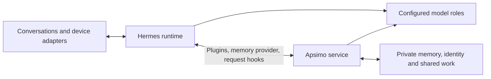

# Apsimo PsuedoAGI

[](LICENSE)
[](https://github.com/Aevonix/Apsimo/actions/workflows/ci.yml)

Apsimo adds persistent memory, shared work and evolving agent state to
[Hermes](https://github.com/NousResearch/hermes-agent). It connects conversations
and background tasks to the same private records, so an agent can carry knowledge
and commitments between sessions while its models change.

Hermes provides the conversations, tools and execution runtime. Apsimo supplies
relevant memories, a view of work in progress, and the state used for preferences,
relationships and initiative. Each deployment defines its own agent identity,
model endpoints, channels and optional devices.

Formerly ColonyAI. Existing installations should follow the
[migration guide](docs/APSIMO-MIGRATION.md); historical names and state paths remain valid.

## Mission: what we mean by pseudo-AGI

Our goal is a persistent agent that learns from experience, carries work across
conversations, develops evidence-based judgments, and acts within its owner's
authority. The owner should be able to inspect what it knows, correct it, ask
what it is doing, and see whether an attempted improvement actually helped.

We use **pseudo-AGI** for that combination of observable behaviors:

- **Persistence:** knowledge, identity and unfinished work survive a session,
  process restart or model change.
- **One mind:** conversations, workers and scheduled tasks share commitments
  and relevant context. The owner can keep talking while work continues.
- **Evolving memory:** ordinary use produces useful retained evidence;
  recollection brings relevant information into later decisions. Corrections,
  contradictions and forgetting have explicit consequences.
- **Selfhood and relationships:** identity, values, preferences and working
  opinions are inspectable state that can influence behavior and be corrected.
- **Autonomy:** the agent can notice something worth doing, judge whether it is
  authorized, act or propose work, and follow through without repeated prompting.
- **Measured improvement:** a change earns adoption by improving a real task
  without hiding regressions.

The term describes our engineering target. Consciousness is outside these
acceptance criteria. Model capability still limits reasoning and behavior;
shared state cannot make every processor equally capable.

## Where we are today

**Phase 1 is in development and behavioral validation.** Installable packages,
native Hermes integration and substantial parts of the system are available.
The complete unified-agent goal remains unfinished.

The supported core includes [source memory](docs/MEMORY-QUALITY.md), automatic
recollection, [shared task controls](docs/NATIVE-TASK-CHANNELS.md),
[contact identity and preferences](docs/SOCIAL-STATE.md), named model routing,
and guided private setup. Readers retain links to original images, audio,
documents and selected video. Native skill proposal, evaluation and rollback
mechanisms are also available.

These mechanisms have stronger evidence than the complete autonomous behavior.
Recollection and task continuity have passed bounded trials, while ordinary-use
quality, responsiveness and unattended operation need further validation.
Unsupported model claims remain a measured weakness. Complete forgetting across
old transcripts, unlinked copies and backups remains open.

Automatic persistent opinions are experimental and disabled by default.
Relationship state does not grant permissions. A selected skill evaluator does
not establish general self-improvement.

The roadmap below identifies the remaining outcomes. The [changelog](CHANGELOG.md)
records implementation changes, and [known gaps](docs/KNOWN-GAPS.md) covers partial
and retired components. Availability depends on the selected profile, model and
deployment adapters.

## How Apsimo connects to Hermes



Hermes owns channel transport, tool execution, native scheduling and workers.
Apsimo connects through its plugin and memory-provider contracts, with an HTTP
API for authenticated deployment adapters. It observes native work instead of
adding a second task scheduler.

**Ordinary turns recall context before generation.** The memory provider selects
context for the current participant and question. During a longer tool loop, source freshness
checks and the [current-work view](docs/REQUEST-WORK-CONTEXT.md) run at model-request
boundaries. Full recollection remains once per turn. This keeps a continuing task
aware of relevant changes without replaying all stored memories into every request.

**Canonical evidence is separate from search indexes.** SQLite supports the
minimum deployment. Optional Lance indexes provide semantic retrieval; their
embedding generations are replaceable. Existing extended deployments can retain
legacy Neo4j records, which are not yet fully reconstructible from canonical
sources. Adding a database does not resolve poor memory admission or retrieval.

**Models are replaceable processors.** [Named function roles](docs/FUNCTION-ROUTING.md)
select configured endpoints and fallbacks. Later requests can use updated
bindings while in-flight work retains its selection. Automatic fleet enrollment,
capacity scheduling and empirical model selection remain roadmap work. Local
inference is supported without a cloud-model dependency for normal operation.

**Each agent remains private.** Identity, credentials, relationship data, model
addresses and device configuration belong outside the public repository. Voice,
cameras, phones, panels and other hardware connect through deployment adapters.
The public system does not assume a particular household or hardware fleet.

The [architecture guide](docs/ARCHITECTURE.md) describes state ownership and
extension boundaries. Reuse the host's facilities before adding a subsystem.

## Progress roadmap

### Phase 1: demonstrate a useful unified agent

This phase completes and validates the current system. Its milestones close on
observed outcomes, rather than component counts or test totals.

| Milestone | Current position | Acceptance outcome |
| --- | --- | --- |
| Useful persistent memory | Implemented; quality validation continues | A correction given through one channel is applied in another after a model swap, with the right source and uncertainty. Low-value material does not crowd it out. |
| Correction and forgetting | Source lifecycle implemented; complete erasure unfinished | Contradictions remain inspectable. Supported memory and history tools cannot resurface forgotten material. Derived copies are removed, and backup handling and unsupported copies are accounted for. |
| Conversation during work | Implemented; cross-channel acceptance continues | The owner talks, inspects progress, changes direction or cancels from another enrolled channel while the same task retains its identity and constraints. |
| Self, contacts and relationships | State and correction paths implemented; usefulness under evaluation | A supported change in preference or working opinion produces an explainable behavioral change. Uncertain identity matches stay unresolved until supported. |
| Multimodal recollection | Supported readers implemented; coverage incomplete | Useful information from text, images, audio, documents and selected video is recalled with traceable originals and accurately stated limits. |
| Initiative and follow-up | Execution and observation paths implemented; outcome quality incomplete | A relevant opportunity or overdue commitment produces one useful authorized action or proposal, with delivery and outcome observed. |
| Model-role qualification | [Evaluation suite available](docs/MODEL-QUALIFICATION.md); coverage expanding | Compare candidate models on the actual consumers they will serve, including quality, latency, failure behavior and memory use. Preserve unsuccessful attempts. |
| Useful self-improvement | Proposal/evaluation/rollback paths implemented; end-to-end benefit unproven | The agent diagnoses a recurring failure, authors a change, improves an independently evaluated task and detects a measured regression. Consequential activation uses owner authorization. |
| Installation and unattended operation | Setup and recovery mechanisms implemented; wider acceptance incomplete | A new private installation completes the supported behaviors, survives representative service failures and upgrades, and retains current memory, tasks and permissions through recovery. |

Phase 1 is complete when these outcomes hold on the selected production runtime
and configuration, including ordinary use and recovery. A controlled model
response proves an integration contract; an observed real task establishes its
value. Physical device coverage is recorded per deployment.

When a behavior works and its meaningful failure cases are covered, move on.
Prefer a small repair to another review service, approval layer or parallel
implementation of something Hermes already provides.

### Phase 2: recursive improvement of the agent system

Phase 2 begins after Phase 1 is validated. The next learning loop is:

1. Detect a recurring failure or opportunity from retained outcomes.
2. Form a hypothesis and propose a bounded change to a skill, playbook, prompt,
   retrieval strategy or non-core code.
3. Compare it with the current behavior on independent task cases.
4. Adopt an authorized improvement, observe its real effect and roll back a regression.
5. Retain what the experiment established so the next attempt starts with better evidence.

The first target is learning through memory, strategies and evaluated system
changes. Model fine-tuning is optional future work. Claims of recursive
improvement require evidence that successive learning cycles themselves become
more effective. A self-written patch or a successful self-review is insufficient.

## Start with Hermes

Use Python 3.12, an existing supported Hermes deployment and one local
OpenAI-compatible chat endpoint. The lightweight profile needs no Docker,
Neo4j, embedding model or external account.

The current qualification target is Hermes 0.21.2; 0.21.0 and 0.21.1 attachment
remain supported. Optional concurrent tasks and current detached-review
integration use the [documented compatibility build](docs/HERMES-HOOK-COMPATIBILITY.md).
Setup does not patch Hermes core or restart an existing gateway. The daily
upstream compatibility check is separate from the pinned release checks.

Install matching packages in a private environment:

```bash
python3 -m venv "$HOME/.local/share/apsimo/venv"
source "$HOME/.local/share/apsimo/venv/bin/activate"
python -m pip install "apsimo[hermes]==1.3.3" "apsimo-hermes[native-memory]==1.3.3"
apsimo init --hermes-python /path/to/hermes/.venv/bin/python
```

The wizard selects a Hermes profile and creates private state outside Git. It
asks for the agent identity, owner details, model and operating preferences,
while preserving existing identity, channels and model settings. Replacing an
existing memory provider is an explicit choice.

Accept the startup option or run:

```bash
apsimo --instance /path/to/private/apsimo start --detach
apsimo --instance /path/to/private/apsimo status
```

Start a fresh Hermes session, provide a harmless fact and ask for it in another
session. Confirm the source and answer. The minimum profile remembers and
observes; background execution and external effects need deliberate configuration.
Consequential actions require owner authorization. Work and its results should
survive a missed notification.

The [setup guide](docs/LOCAL-HERMES-SETUP.md) covers services, native tasks,
[accepted local drafts](docs/ACCEPTED-LOCAL-WORK.md), existing profiles and recovery.
For upgrades, follow the
[adapter refresh procedure](docs/LOCAL-HERMES-SETUP.md#update-an-existing-attachment).
A package upgrade alone does not replace an adapter copied into a profile.

## Further reading

- Memory: [claims](docs/SOURCE-CLAIMS.md), [annotations](docs/SOURCE-ANNOTATIONS.md),
  [semantic recall](docs/SOURCE-SEMANTIC-RECALL.md),
  [request erasure](docs/NATIVE-REQUEST-ERASURE.md),
  [backup and recovery](docs/SOURCE-MEMORY-RECOVERY.md).
- Media: [images](docs/SOURCE-IMAGES.md), [audio](docs/SOURCE-AUDIO.md),
  [documents](docs/SOURCE-DOCUMENTS.md), [selected video](docs/SOURCE-VIDEOS.md).
- Agent state: [working perspective](docs/WORKING-PERSPECTIVE.md),
  [working judgments](docs/SELF-JUDGMENTS.md),
  [reply forecasts](docs/EXPECTED-REPLY-FORECASTS.md),
  [commitments](docs/COMMITMENT-WORK.md).

## Development

```bash
python -m pip install -e './sidecar[dev]'
cd sidecar
python -m pytest -q tests apsimo
```

`tests/hermes_adapter` qualifies built packages against the pinned native Hermes
runtime. Deployment acceptance additionally needs real inference, source
receipts, cross-session behavior and recovery with the actual configuration.
Keep personal data, endpoint addresses, secrets and deployment configuration out
of public examples, commits and test artifacts.

## License

[MIT](LICENSE). Optional dependencies retain their own licenses.
