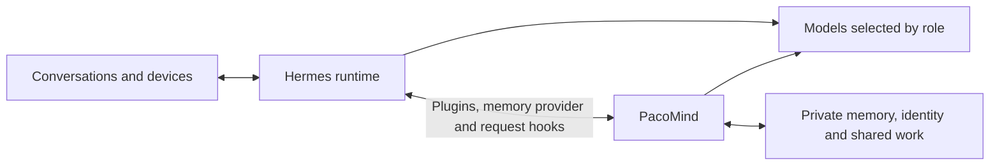

# PacoMind

**PACO: Persistent Autonomous Cognitive Orchestration**

[](LICENSE)
[](https://github.com/Aevonix/PacoMind/actions/workflows/ci.yml)

PacoMind is an effort to achieve **pseudo-AGI** through persistent memory,
an evolving identity, autonomous initiative and internal deliberation. It connects
to [Hermes](https://github.com/NousResearch/hermes-agent) so an agent can carry
knowledge and unfinished work across conversations, channels and model changes.

Hermes provides the runtime: conversations, tools, channels and workers.
PacoMind supplies the shared memory and state that let those activities contribute
to one continuing agent. Each deployment creates its own private identity and
chooses its models, channels and devices.

## What we are trying to achieve

We use **pseudo-AGI** for a practical goal: an agent that remembers what matters,
forms and revises its own working judgments, keeps commitments, acts on useful
opportunities and improves through experience. The owner should be able to keep
talking to it while it works, correct its understanding and inspect the reasons
behind its decisions.

Unlocking autonomy means allowing the agent to initiate and complete authorized
work between messages. **Inner thought** means reviewing events, open questions
and unfinished tasks through background deliberation, then turning useful
conclusions into plans, memories or proposed actions. Those processes need to
produce observable value; running another model call is not evidence of progress.

General intelligence is the ambition, not an achieved capability. The underlying
models still determine much of the agent's reasoning ability. PacoMind aims to
make learning and continuity survive changes to those models.

## How it works

| Part | Contribution |
| --- | --- |
| Persistent memory | Retains original evidence and its source, speaker and time. Corrections can supersede earlier information. Search indexes can be rebuilt without changing the originals. |
| Automatic recollection | Selects relevant memory before an ordinary reply. Later model requests check source validity and refresh the view of ongoing work. The agent can search explicitly or open the original evidence when it needs more context. |
| Shared work | Connects conversations to Hermes tasks, workers and schedules. The agent can inspect, steer or stop enrolled work while a separate conversation continues. |
| Identity and relationships | Stores preferences, contact links, appraisals and working judgments outside any one model. Owner corrections remain attributable. Relationship estimates are separate from access permissions. |
| Background deliberation | Reviews the agent's situation and proposes work through the existing initiative path. Its operating mode and cadence belong to the deployment. |
| Learning | Uses ordinary experience to improve remembered knowledge and preferences. Skill proposals, evaluation and rollback provide a path toward broader improvements. Reliable autonomous self-improvement remains a development goal. |



**Memory belongs to the agent, independently of the model.** SQLite holds
canonical source records in the minimum installation. Optional Lance indexes
add semantic retrieval. Memory can retain and reopen images, audio, documents
and selected video, with provenance linking derived descriptions to originals.
An embedding model change can replace an index without replacing the evidence.

**Models are replaceable processors.** Named roles select models for interaction,
reasoning, extraction, judging, vision and other functions, with configured
fallbacks. Local inference supports normal operation without a cloud model.
The model qualification suite measures role-specific quality and latency;
automatic fleet enrollment and selection from those measurements remain planned.

**Deployment details stay private.** The guided setup attaches to an existing
Hermes profile. Identity, credentials, contact records, model addresses and device
settings stay outside the public repository. Voice systems, cameras, phones and
panels connect through deployment adapters. Consequential actions use owner
authorization, and missed notifications should leave work recoverable.

See the [architecture guide](docs/ARCHITECTURE.md) for storage ownership and
integration boundaries.

## Current status

**Phase 1 is in development and validation.** The memory integration, source
readers, shared task controls, contact preferences, model roles and guided setup
are implemented. Limited trials have shown useful automatic recall and awareness
of work in other sessions.

Reliability is unfinished. Models still add unsupported claims, delegated tasks
can stall, and consistent behavior across physical channels needs more evidence.
Complete forgetting across transcripts, unlinked copies and backups is unfinished.
Automatic persistent opinions are experimental and disabled by default. Useful
background initiative and autonomous self-improvement still need complete
demonstrations in ordinary use.

Until Phase 1 is validated, development releases may change interfaces and
storage layouts. The [known gaps](docs/KNOWN-GAPS.md) and
[changelog](CHANGELOG.md) describe the current implementation in more detail.

## Get started

You need Python 3.12, a supported Hermes deployment and one OpenAI-compatible
chat endpoint. The minimum profile does not require Docker, a graph database
or an embedding model.

```bash
python3.12 -m venv "$HOME/.local/share/pacomind/venv"
source "$HOME/.local/share/pacomind/venv/bin/activate"
python -m pip install --upgrade "pacomind[hermes]" "pacomind-hermes[native-memory]"
pacomind init --hermes-python /path/to/hermes/.venv/bin/python
```

The wizard selects a Hermes profile and asks for identity, owner, model and
operating preferences. It preserves existing channel and model settings;
replacing an existing memory provider is an explicit choice. Accept its startup
option, or use your instance path:

```bash
pacomind --instance /path/to/private/pacomind start --detach
pacomind --instance /path/to/private/pacomind status
```

Start a fresh Hermes session, provide a harmless fact and ask for it in another
session. Check the remembered source as well as the answer. The minimum profile
provides memory and work observation; background execution needs configuration.

The current qualification target is Hermes 0.21.2. Some concurrent task and
review interfaces use the [documented compatibility build](docs/HERMES-HOOK-COMPATIBILITY.md).
Setup does not patch Hermes core or restart a running gateway. The
[setup guide](docs/LOCAL-HERMES-SETUP.md) covers services, profile attachment,
tasks and adapter updates.

PacoMind includes **Deep Research** and **Skill Creator** skills. Hermes lists
their short descriptions and loads the instructions when needed. They use the
tools and models configured for that deployment.

## Roadmap

### Phase 1: a useful persistent agent

Completion requires useful outcomes on a real deployment, including ordinary
use and recovery.

| Outcome | What must work |
| --- | --- |
| Remember across models and channels | Apply a fact or correction from one conversation in another after a model swap, using the right evidence. |
| Maintain quality | Keep low-value material from crowding out useful memory. Handle contradictions, corrections and forgetting consistently. |
| Continue work during conversation | Inspect, redirect or cancel the same task from another enrolled channel without losing its state or permissions. |
| Use a coherent identity | Show how a stored preference or judgment changes behavior. Resolve uncertain contact identities before joining their records. |
| Recall beyond text | Recover useful information from supported media and reopen the relevant original. |
| Take useful initiative | Notice an opportunity or overdue commitment, take an authorized next step and follow it through without repeated alerts. |
| Improve a recurring failure | Diagnose a problem, evaluate a change on an independent task, demonstrate a benefit and recover from a regression. |
| Install, upgrade and recover | Set up a private agent and recover from service failures or updates with its memory, tasks and permissions intact. Qualify models for their actual roles. |

### Phase 2: improve the learning process

After Phase 1 is validated, extend the learning loop to skills, playbooks,
prompts, retrieval strategies and non-core code. The agent should identify a
recurring failure, propose a change, compare it with the current behavior,
adopt an authorized improvement and retain the result for its next attempt.

Recursive improvement requires showing that this process becomes more effective
over successive cycles. Model fine-tuning is an optional later path.

## Documentation

- **Memory:** [quality](docs/MEMORY-QUALITY.md),
  [semantic recall](docs/SOURCE-SEMANTIC-RECALL.md),
  [corrections](docs/SOURCE-ANNOTATIONS.md),
  [erasure](docs/NATIVE-REQUEST-ERASURE.md),
  [backup and recovery](docs/SOURCE-MEMORY-RECOVERY.md).
- **Media:** [images](docs/SOURCE-IMAGES.md), [audio](docs/SOURCE-AUDIO.md),
  [documents](docs/SOURCE-DOCUMENTS.md), [video](docs/SOURCE-VIDEOS.md).
- **Agent state:** [contacts](docs/SOCIAL-STATE.md),
  [working perspective](docs/WORKING-PERSPECTIVE.md),
  [judgments](docs/SELF-JUDGMENTS.md), [commitments](docs/COMMITMENT-WORK.md).
- **Execution:** [shared tasks](docs/NATIVE-TASK-CHANNELS.md),
  [accepted local work](docs/ACCEPTED-LOCAL-WORK.md),
  [model roles](docs/FUNCTION-ROUTING.md),
  [model qualification](docs/MODEL-QUALIFICATION.md).

## Development

```bash
python -m pip install -e './sidecar[dev]'
cd sidecar
python -m pytest -q tests pacomind
```

`tests/hermes_adapter` checks built packages against the pinned Hermes runtime.
Deployment validation also needs real inference, attributable sources, work
across sessions and recovery with the actual configuration. Keep private data,
credentials and deployment configuration out of public commits and examples.

## License

[MIT](LICENSE). Optional dependencies retain their own licenses.
