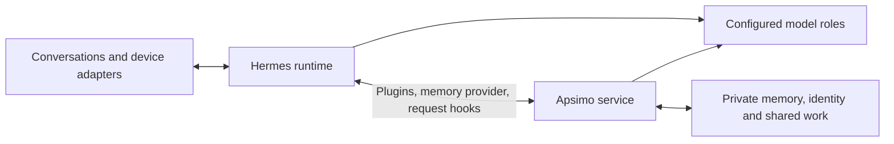

# Apsimo PsuedoAGI

**Autonomous Persistent Selfness, Intelligence & Memory Orchestration**

[](LICENSE)
[](https://github.com/Aevonix/ApsimoAGI/actions/workflows/ci.yml)

Apsimo gives a [Hermes](https://github.com/NousResearch/hermes-agent) agent
persistent memory and a shared view of its ongoing work. Conversations and
background tasks use the same private records, keeping knowledge, identity and
commitments available across sessions and model changes.

Hermes handles conversations and tools. Apsimo adds recollection, task
coordination, and the stored preferences and relationships that guide the agent.
Each installation has its own identity, models, channels and optional devices.

Phase 1 establishes the first supported release. Until its validation is
complete, development releases may change interfaces and storage layouts.

## Mission: what we mean by pseudo-AGI

Build an agent that remembers what matters, keeps its commitments and improves
through use. You should be able to inspect what it knows, correct it, ask what
it is doing, and continue working with it across conversations and model changes.

We use **pseudo-AGI** to describe these goals:

- **Persistence:** knowledge, identity and unfinished work survive a session,
  process restart or model change.
- **One mind:** conversations, workers and scheduled tasks share commitments
  and relevant context. The owner can keep talking while work continues.
- **Evolving memory:** the agent learns useful information from ordinary use,
  recalls it when needed, notices contradictions and respects corrections and
  requests to forget.
- **Selfhood and relationships:** identity, values, preferences and opinions
  influence behavior. The owner can inspect and correct them.
- **Autonomy:** the agent can notice something worth doing, judge whether it is
  authorized, act or propose work, and follow through without repeated prompting.
- **Measured improvement:** changes improve real tasks, and the agent detects
  and reverses regressions.

Reasoning and behavior still depend on the models selected for each role.

## Where we are today

**Phase 1 is still in development and validation.** Packages and Hermes
integration are available; the full set of behaviors above is unfinished.

The supported core includes [source memory](docs/MEMORY-QUALITY.md), automatic
recollection, [shared task controls](docs/NATIVE-TASK-CHANNELS.md),
[contact identity and preferences](docs/SOCIAL-STATE.md), named model routing,
and guided private setup. Memory can link back to original images, audio,
documents and selected video. Skill proposal, evaluation and rollback are
implemented.

Limited trials have demonstrated useful recollection and tasks continuing across
sessions. Reliability in everyday use, response time and unattended recovery
still need improvement and testing. Models still make unsupported claims.
Complete forgetting across old transcripts, unlinked copies and backups remains
unfinished.

Automatic persistent opinions are experimental and disabled by default. Trust
and relationship estimates are separate from permissions. Useful autonomous
self-improvement still needs an end-to-end demonstration.

The roadmap below lists the remaining outcomes. See the [changelog](CHANGELOG.md)
for releases and [known gaps](docs/KNOWN-GAPS.md) for partial and retired
components. Available features depend on the profile, models and adapters you use.

## How Apsimo connects to Hermes



Hermes owns channel transport, tool execution, native scheduling and workers.
Apsimo connects through plugins, the memory-provider contract and request hooks.
Authenticated deployment adapters use its HTTP API. Shared task state follows
work running in Hermes.

**Recall happens before an ordinary reply begins.** Apsimo selects memories for
the current person and question. While the agent uses tools, each model request
checks whether its sources are still valid and refreshes the
[view of current work](docs/REQUEST-WORK-CONTEXT.md). Full recollection runs once
per turn.

**Source records outlive search indexes.** SQLite supports the minimum
installation. Optional Lance indexes support semantic search and can be replaced
when embedding models change. A separate optional Neo4j memory graph remains
in the code. It is not required by the supported setup, and graph records
without canonical sources cannot be reconstructed from those sources.

**Models are assigned by role.** [Named roles](docs/FUNCTION-ROUTING.md) select
configured endpoints and fallbacks. Later requests can use new assignments while
work already running keeps its selection. Normal operation supports local
inference without a cloud-model dependency. Automatic fleet enrollment, capacity scheduling and model selection
based on measured results remain planned work.

**Each installation owns its private data.** Identity, credentials, relationships,
model addresses and device settings stay outside the public repository. Private
adapters connect voice systems, cameras, phones, panels and other hardware.

The [architecture guide](docs/ARCHITECTURE.md) describes state ownership and
the interfaces between Apsimo and Hermes.

## Progress roadmap

### Phase 1: demonstrate a useful unified agent

Each milestone requires a working outcome on a real deployment.

| Milestone | Current position | Acceptance outcome |
| --- | --- | --- |
| Useful persistent memory | Implemented; reliability needs improvement | Apply a correction from one channel in another after a model swap, citing the right source. Keep low-value material from crowding it out. |
| Correction and forgetting | Correction paths implemented; complete erasure unfinished | Show contradictions and their sources. Remove forgotten material from supported recall/history tools and derived stores, with an explicit policy for backups and other copies. |
| Conversation during work | Implemented; real channel testing continues | Talk, inspect progress, change direction or cancel from another enrolled channel while the same task keeps its identity and permissions. |
| Self, contacts and relationships | Stored state and corrections implemented; usefulness under evaluation | Explain how a preference or opinion changed a decision. Resolve uncertain identity matches before linking people across channels. |
| Multimodal recollection | Readers implemented; coverage incomplete | Recall useful information from text, images, audio, documents and selected video, with links to the originals and accurate limits. |
| Initiative and follow-up | Execution paths implemented; useful outcomes incomplete | Notice a relevant opportunity or overdue commitment, take one authorized action or make a proposal, and follow it through. |
| Model-role qualification | [Evaluation suite available](docs/MODEL-QUALIFICATION.md); coverage expanding | Compare models in the functions they will serve, measuring quality, latency, failures and memory use. Retain failed attempts in the results. |
| Useful self-improvement | Proposal, evaluation and rollback implemented; benefit unproven | Diagnose a recurring failure, author a change, improve an independently evaluated task and detect a regression. Use owner authorization for consequential changes. |
| Installation and unattended operation | Setup and recovery implemented; wider testing incomplete | Install a private agent, demonstrate the supported behaviors, and recover from service failures and upgrades with memory, tasks and permissions intact. |

Phase 1 is complete when these outcomes hold in production, including ordinary
use and recovery. Controlled tests verify integration; real tasks establish
usefulness. Physical device coverage is recorded for each deployment.

### Phase 2: recursive improvement of the agent system

Phase 2 begins after Phase 1 is validated. The next learning loop is:

1. Detect a recurring failure or opportunity from previous outcomes.
2. Form a hypothesis and propose a specific change to a skill, playbook, prompt,
   retrieval strategy or non-core code.
3. Compare it with the current behavior on independent task cases.
4. Adopt an authorized improvement, observe its real effect and roll back a regression.
5. Record the result so the next attempt can build on it.

The first target is learning through memory, strategies and evaluated system
changes. Model fine-tuning is optional future work. Recursive improvement will
require showing that the learning process itself becomes more effective over
successive cycles.

## Start with Hermes

Use Python 3.12, an existing supported Hermes deployment and one local
OpenAI-compatible chat endpoint. The lightweight profile needs no Docker,
Neo4j, embedding model or external account.

The qualification target is Hermes 0.21.2. Optional concurrent tasks and
current detached-review
integration use the [documented compatibility build](docs/HERMES-HOOK-COMPATIBILITY.md).
Setup does not patch Hermes core or restart an existing gateway. The daily
upstream compatibility check is separate from the pinned release checks.

Install matching packages in a private environment:

```bash
python3 -m venv "$HOME/.local/share/apsimo/venv"
source "$HOME/.local/share/apsimo/venv/bin/activate"
python -m pip install "apsimo[hermes]==1.4.5" "apsimo-hermes[native-memory]==1.4.5"
apsimo init --hermes-python /path/to/hermes/.venv/bin/python
```

The wizard selects a Hermes profile and creates private state outside Git. It
asks for the agent identity, owner details, model and operating preferences,
while preserving existing identity, channels and model settings. Replacing an
existing memory provider is an explicit choice.

The bundled Deep Research and Skill Creator skills provide reusable research and
skill-authoring workflows. Hermes lists their short descriptions and loads the
instructions when needed. They use the deployment's configured tools and models.

Accept the startup option or run:

```bash
apsimo --instance /path/to/private/apsimo start --detach
apsimo --instance /path/to/private/apsimo status
```

Start a fresh Hermes session, provide a harmless fact and ask for it in another
session. Confirm the source and answer. The minimum profile provides memory and
work observation; background execution and external actions need configuration.
Consequential actions require owner authorization. Work and its results should
survive a missed notification.

The [setup guide](docs/LOCAL-HERMES-SETUP.md) covers services, native tasks,
[accepted local drafts](docs/ACCEPTED-LOCAL-WORK.md), existing profiles and recovery.
For updates within the current baseline, follow the
[adapter refresh procedure](docs/LOCAL-HERMES-SETUP.md#update-an-existing-attachment).
A package upgrade alone does not replace an adapter copied into a profile.

## Further reading

- Memory: [claims](docs/SOURCE-CLAIMS.md), [annotations](docs/SOURCE-ANNOTATIONS.md),
  [semantic recall](docs/SOURCE-SEMANTIC-RECALL.md),
  [request erasure](docs/NATIVE-REQUEST-ERASURE.md),
  [backup and recovery](docs/SOURCE-MEMORY-RECOVERY.md).
- Media: [images](docs/SOURCE-IMAGES.md), [audio](docs/SOURCE-AUDIO.md),
  [documents](docs/SOURCE-DOCUMENTS.md), [selected video](docs/SOURCE-VIDEOS.md).
- Agent state: [working perspective](docs/WORKING-PERSPECTIVE.md),
  [working judgments](docs/SELF-JUDGMENTS.md),
  [reply forecasts](docs/EXPECTED-REPLY-FORECASTS.md),
  [commitments](docs/COMMITMENT-WORK.md).

## Development

```bash
python -m pip install -e './sidecar[dev]'
cd sidecar
python -m pytest -q tests apsimo
```

`tests/hermes_adapter` tests built packages against the pinned Hermes runtime.
Deployment testing also needs real inference, traceable sources, tasks across
sessions and recovery with the actual configuration.
Keep personal data, endpoint addresses, secrets and deployment configuration out
of public examples, commits and test artifacts.

## License

[MIT](LICENSE). Optional dependencies retain their own licenses.
