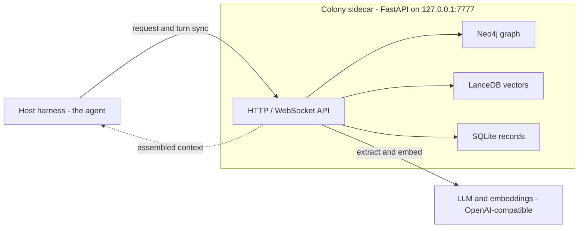

<div align="center">

# Colony

A local-first cognition sidecar for AI agents: persistent memory, relationships,
temporal awareness, earned autonomy, and self-improvement.

[](LICENSE)
[](https://pypi.org/project/colonyai/)
[](https://github.com/Aevonix/ColonyAI/actions/workflows/ci.yml)
[](https://github.com/Aevonix/ColonyAI/releases)
[](https://pypi.org/project/colonyai/)

</div>

## Overview

Colony is a sidecar process that gives any agent durable state and, when you
want it, carefully governed agency. It runs alongside the agent's host (a chat
gateway, a coding tool, or anything that can call an HTTP API), assembles
relevant context before each turn, learns from each turn afterward, and can
pursue goals between turns.

The agent stays stateless; Colony holds the state. Memories, facts,
commitments, relationships, beliefs, projects, skills, and time all persist
across sessions and outlive any single conversation. Everything runs locally
against your own stores and your own model endpoints.

Colony is not an agent and does not generate user-facing replies. It is the
layer underneath one.

One design rule governs everything else: **a check that could not run must
never report that it passed.** Verification paths return `unavailable` or
`unverified` when they could not verify — never a fabricated `pass` or
`clean`. Subsystems that only observe say so wherever their results surface.
And anything that exists in code but is not fully wired is inventoried in
[docs/KNOWN-GAPS.md](docs/KNOWN-GAPS.md) rather than implied to work. The
[Operational posture](#operational-posture--what-is-actually-enforced)
section below states plainly which subsystems enforce by default (few) and
which observe (most); read it before assuming anything is blocking.

## Quick start

Requirements: Python 3.11+, Neo4j 5.x reachable over Bolt, and an
OpenAI-compatible LLM and embedding endpoint.

```bash
pip install colonyai

# Interactive wizard: identity, state dir, Neo4j, API key, model endpoints,
# autonomy preset, and any detected agent harnesses
colony init

# Diagnose configuration and (if running) live runtime health
colony doctor

# Start the sidecar
colony start -d             # daemon; omit -d to run in the foreground
```

Verify it is up:

```bash
curl -s -H "Authorization: Bearer $COLONY_API_KEY" \
  http://127.0.0.1:7777/v1/host/health
```

To run the sidecar and Neo4j together under Docker, clone this repo and use
the provided `docker-compose.yml` (it builds the sidecar image from
`./sidecar`, so compose needs the repo checkout; the pip path above does not).

## The autonomy model

Agency in Colony is *earned, not configured*. Two mechanisms work together:

- **One knob:** `COLONY_AUTONOMY_PRESET` supplies coherent defaults for all
  seventeen autonomy flags at once. `passive` observes and remembers only;
  `calibration` (the wizard default) runs every subsystem in shadow or
  dry-run; `autonomous` runs them live. An explicitly set env var always wins
  over the preset, and the exploration sandbox never goes live from a preset.
  Since v0.34.0 an active preset also supplies the autonomy *loop* mode when
  `COLONY_AUTONOMY_MODE` is unset (`passive`: reactive;
  `calibration`/`autonomous`: proactive) — previously a preset without an
  explicit proactive loop was a Colony where everything looked enabled and
  nothing ever ticked. `COLONY_PRESET_LOOP_COUPLING=off` restores the old
  env-only resolution, and the posture endpoint reports
  `COLONY_AUTONOMY_MODE_SOURCE` (`env`/`preset`/`legacy_tick`/`default`) so a
  preset-inherited mode is always visible.
- **The trust engine:** every action class carries a stage
  (`shadow` → `ask_first` → `act_first`) and a confidence score computed from
  its real, journaled track record. Clean calibration graduates a class to
  asking first; a proven record graduates it to acting first, and each
  graduation notifies the owner. Failures trip a circuit breaker back to
  `ask_first`, and an immutable floor (money movement, irreversible deletion,
  credential changes, bulk messaging) is never self-decidable at any
  confidence. Every gate decision lands in a unified action journal
  (`colony-action-journal.db`), and the daily proactive-delivery cap adapts to
  the delivery domain's own track record.

`GET /v1/host/autonomy/posture` returns the resolved posture of the running
process, so you always see what is actually in effect rather than what you
think you configured.

## Operational posture — what is actually enforced

**Colony ships observing, not enforcing.** Unless you explicitly set an
enforcement mode, the governance subsystems evaluate, journal, and report —
they do not block. This is deliberate (calibration data must come before
enforcement authority), but it means an operator who skims a feature list can
believe something is being enforced when it is only being watched. The table
below is the truth of the shipped defaults:

| Control | Default | What the default actually does | To enforce / go live |
| --- | --- | --- | --- |
| `COLONY_GUARD_MODE` (outbound ResponseGuard) | `shadow` | Evaluates and audits every guarded reply; never changes the outcome | `enforce` — and note `COLONY_GUARD_ENFORCE_CHECKS` (default `secret_leak,tom2_epistemic`) is a per-check block allowlist, so even in enforce only those checks may block until you set it to `all` |
| `COLONY_APPROVAL_AUTHORITY_MODE` | `shadow` | Approval requests, decisions, and bounded grants are durably recorded but **not** enforced against real effects | `enforce` |
| `COLONY_WORKERS_MODE` (worker governor) | `shadow` | Every worker claim is re-evaluated server-side and journaled, then allowed anyway (`would_refuse` is recorded, not acted on) | `live` |
| `COLONY_WORKER_AUTHORITY_MODE` (HTTP worker identity) | `shadow` | Legacy/global-bearer workers stay usable; their future denial posture is recorded | `enforce` (requires scoped worker principals plus an exact keyring `worker_grant`) |
| `COLONY_DIRECTED_MODE` (directed delegation) | `dry_run` | Prepares directed tasks and dispatches nothing | `live` |
| `COLONY_SANDBOX_MODE` (code execution) | `off` | No code execution; `dry_run` plans without running | `live` — explicit only; **no preset ever sets it** |
| `COLONY_TOM2` / `COLONY_TOM2_LEVEL` | `off` / `0` | Second-order theory-of-mind renders nothing beyond the owner path | Raise the level — but level 2 stays capped at 1 regardless until a receipt-backed applied-output evidence probe exists, which nothing currently ships ([docs/KNOWN-GAPS.md](docs/KNOWN-GAPS.md)) |
| `COLONY_COGNITION_SPINE` / `COLONY_SITUATION_SPINE` / `COLONY_DRIVE_GOVERNANCE_MODE` | `off` | The typed cognition ledgers (P3 goal spine, P6 situation spine, P7 drive governance) do not run | `shadow`, then `live` |
| `COLONY_RECALL_RERANK` | `off` | Recall returns ANN order; no cross-encoder is called | `shadow` (score and log the rank delta, return ANN order unchanged), then `on` |
| Governed actions | not configured | The `/v1/host/actions/*` endpoints refuse every request | Configure the exact `host-action-worker` keyring principal (template: `sidecar/api-keyring.example.json`) |

Three things to hold onto:

- **The running process tells the truth about itself.**
  `GET /v1/host/autonomy/posture` and `colony doctor` report *resolved*
  modes, not intended ones. The doctor explicitly WARNs when approval
  authority is shadow while an effects-on subsystem (workers or sandbox
  `live`) runs — that combination means real effects are happening while
  approval decisions are only being recorded.
- **Audit rows prove evaluation, not enforcement.** A guard verdict row means
  the text was evaluated; it is not durable proof that a transport withheld
  or revised the bytes. In particular, the Hermes ResponseGuard integration
  is shadow-only on current Hermes regardless of `COLONY_GUARD_MODE`,
  because its post-LLM hook cannot mutate replies
  ([docs/KNOWN-GAPS.md](docs/KNOWN-GAPS.md)).
- **Invalid enforcement configuration fails closed, loudly.** An
  unrecognised `COLONY_GUARD_MODE` refuses to start the server. An invalid
  `COLONY_APPROVAL_AUTHORITY_MODE` makes approval-scoped API requests return
  503 and fails the doctor. A typo can cost you availability; it can never
  silently cost you the enforcement you asked for.

## Fail-closed guarantees

v0.34.0 closed a class of defects where a verification path could pass
without verifying, or report success while doing nothing. These are now
tested contract, not aspiration:

- `POST /v1/host/safety/check` (and its `/response-gate/check` alias) return
  HTTP 503 with `decision: "unavailable"` — and `blocked: true`, so callers
  keying only on the boolean also fail closed — when the gate is not
  initialized or evaluation raises. They never return `"pass"` for text that
  was not evaluated.
- World-model boundary checks fail closed on exception, matching
  `directives.guard.boundary_fail_closed()` (default true). The sandbox's
  boundary gate reports reason `boundary_unchecked` when no directive
  manager is wired — never a fabricated "ok" — and denies with
  `boundary_check_error` when the check itself raises.
- ResponseGuard records an absent injection detector as an *unavailable*
  check instead of silently skipping it; in enforce mode, an unavailable
  configured check on a guarded text/artifact surface fails closed.
- The tom2 epistemic egress check surfaces internal errors as
  `guard_unavailable` while an injection taint is (or may be) live, rather
  than returning an empty — i.e. clean — finding list. With no live taint it
  stays inert by design, so a fault in the check cannot silence the agent on
  unrelated traffic.
- Directed-task audits verdict `unverified`, never `clean`, when the
  completion report is missing expected fields; a mutating task whose mirror
  audit could not run cannot become `clean` on the report's say-so.
- The worker governor in `off` mode reports its capability/boundary/trust
  checks as `None` ("unchecked") rather than fabricating passes.
- `colony doctor` WARNs when approval authority runs in shadow alongside
  effects-on subsystems (see Operational posture above).
- An unrecognised `COLONY_GUARD_MODE` refuses at startup instead of silently
  degrading to shadow.

Two standing design rules extend the same doctrine to effects:

- **One mutation at most.** The governed-action ledger moves
  `prepared → executing → completed`; any exception after the durable
  `executing` marker becomes a durable `ambiguous` outcome that can never be
  retried as a mutation, and `executing` rows found at process startup are
  recovered as `ambiguous`. Colony prefers an honest uncertain result over
  accidentally applying an effect twice.
- **Nobody attests their own success.** The cognition evidence pipeline
  rejoins project and work-order events to Colony's local immutable ledger;
  external events remain visible as reported/*unverified* observations
  unless a server-owned resolver joins them to an exact local receipt.
  Likewise, a work order's mutating or disclosing effects stay `unverified`
  unless a receipt verifier attests concrete receipt references.

## Connecting an agent

| Path | For | How |
| --- | --- | --- |
| Hermes plugins | Chat/orchestrator agents on [Hermes](https://github.com/NousResearch/hermes-agent) | `colony init --agent-harness hermes` or `plugins/hermes-plugin/install.sh` |
| MCP | Claude Code, Codex, Crush, OpenCode (and Hermes too) | `colony mcp setup` |
| REST API | Anything else | `http://127.0.0.1:7777/v1/host/...` with a bearer key |

All paths read and write the same stores, so a fact learned in a chat is
visible from a coding tool and vice versa. See
[`docs/HARNESS_INTEGRATION.md`](docs/HARNESS_INTEGRATION.md) for the full
guide.

### API authentication

The legacy `COLONY_API_KEY` global bearer still works and remains the
migration credential. New deployments can add a private mode-0600 JSON
keyring (`COLONY_API_KEYRING_PATH`) of *scoped principals*: each credential
binds a service principal to exact API scopes, a viewer person, and explicit
audience lanes; a request body may narrow to a granted lane but can never
broaden authority. Privileged surfaces (governed actions, worker identity
under `COLONY_WORKER_AUTHORITY_MODE=enforce`, approval scopes under
`enforce`) require exact scoped principals and reject the legacy bearer. See
[`docs/SCOPED-API-AUTH.md`](docs/SCOPED-API-AUTH.md) and
`sidecar/api-keyring.example.json`.

### Hermes plugins

| Plugin | Role |
| --- | --- |
| [`plugins/hermes-plugin`](plugins/hermes-plugin/) | General adapter: native Colony tools, slash commands, lifecycle hooks, event subscriber, autonomy bridge, host-side ops tooling |
| [`plugins/colony-memory`](plugins/colony-memory/) | Memory provider: injects assembled context before each turn and syncs the turn back for extraction |
| [`plugins/hermes-context`](plugins/hermes-context/) | Context engine: cognitive compression of the conversation window |
| [`plugins/feeds-manage`](plugins/feeds-manage/) | Conversational management of intelligence feeds ("keep me informed about X") |

## Subsystem tour

- **Memory and graph.** Neo4j holds entities, people, and relationships;
  LanceDB holds vectors. Memory strength follows an Ebbinghaus forgetting
  curve with type-aware half-lives: identity memories never decay,
  procedural memories decay at half rate, and fact/semantic memories can be
  given their own half-life (`COLONY_DECAY_HALF_LIFE_SEMANTIC_DAYS`) so
  distilled knowledge outlives the episodes it came from; the base half-life
  defaults to 7 days and strength is recomputed each pass, never compounded.
  Recall is a pipeline: ANN candidate oversampling
  (`COLONY_RECALL_OVERSAMPLE`) → hard filters (decay-strength floor,
  confidence, and — when a `person_id` scope is given — a hard `ABOUT`-edge
  boundary that never falls back to global recall) → a recency-weighted
  relevance blend → an optional cross-encoder rerank
  (`COLONY_RECALL_RERANK`: `off` default / `shadow` / `on`) → trim to the
  requested limit → touch, so recalled memories are reinforced against
  decay.
- **Contacts and theory of mind.** A contact per person with channel handles,
  trust tier, relationship score, affect tracking, shared facts, and an
  evolving engagement profile.
- **Leveled second-order ToM.** How much who-knows-what reasoning may render
  is resolved per conversation and per reader as a pure min-chain over
  independent brakes — requested level, hard ceiling, environment-risk caps,
  enforce-evidence, and the cross-context flag — so any one brake decaying
  silently drops the level, and any error resolves to level 0. Shipped
  defaults render nothing beyond the existing owner path. See
  [`docs/TOM2-LEVELS.md`](docs/TOM2-LEVELS.md) and
  [`docs/TOM-P8-SOCIAL-BOUNDARIES.md`](docs/TOM-P8-SOCIAL-BOUNDARIES.md).
- **Relationship intelligence.** Per-message sender attribution unifies one
  person across channels (WhatsApp, SMS/RCS, email, voice, in person);
  unknown senders become shadow contacts; machine turns can never pollute a
  person's profile. A profiler composes standing + psyche + approach briefs
  (preferred channel, best time to reach, engagement style) injected into
  context and exposed as the `relationship_brief` tool. A cross-channel
  comms ledger records every exchange and is readable both per contact and
  across everyone (`GET /v1/host/comms/recent`). See
  [docs/RELATIONSHIPS.md](docs/RELATIONSHIPS.md).
- **Temporal awareness.** Authoritative current time, per-contact timezones,
  and a unified journal of every turn and action, so the agent knows when
  things happened and what is overdue.
- **Commitments that resolve durably.** Promises and owed follow-ups are
  tracked with real resolution semantics: settling one records WHY
  (`done | invalid | duplicate | wont_do | obsolete`), cascades between the
  cognitive workspace and the source item so a resolve can never be silently
  undone, deduplicates re-extraction against open AND recently-rejected
  items, and exposes per-source outcome stats
  (`GET /v1/host/commitments/stats/resolution`) so whatever generates items
  learns from what the owner rejects.
- **Governed actions.** One narrow, owner-approved mutation boundary for an
  external action worker: `PUT /v1/host/actions/{uuid}` executes,
  `GET /v1/host/actions/{uuid}` observes, and both require the dedicated
  `host-action-worker` keyring principal carrying exactly the
  `actions:execute` / `actions:verify` scopes and an exact owner binding.
  The request body is the strictly parsed `ColonyGovernedActionExecutionV1`
  document (exact field set, canonical JSON, 32 KiB cap, duplicate-key and
  depth bounds) binding the URL action UUID, action/intent/args/execution
  digests, and a `ColonyOwnerApprovalExecutionBindingV1` owner-approval
  receipt whose lifetime is capped at 24 hours. The approval's liveness is
  asserted again immediately before the durable `executing` marker; every
  ledger transaction rolls back and re-raises on error; and the allowlist is
  ten generic Colony operations (autonomy on/off, commitment create/resolve,
  initiative feedback, insight, research handoff, task complete/snooze/
  dismiss) — conversation context, sender IDs, and arbitrary tool names are
  not accepted. See [`docs/GOVERNED-ACTIONS.md`](docs/GOVERNED-ACTIONS.md).
- **Cognition spine.** Typed, additive ledgers that turn thinking into
  governed work (all `off` by default): the P3 goal spine walks
  Concern → ThoughtJob → GoalProposal → Project, where model text is never
  authority — scope comes from the durable concern and capabilities from
  server policy, and a model cannot resolve a concern or its source; the
  receipt-bound evidence pipeline reduces project/work-order events into
  competence and expectation evidence; and inline per-turn introspection
  (`COLONY_INTROSPECT_ENABLED`) judges each finished turn for owed
  follow-ups with a local LLM. See
  [`docs/COGNITION-GOAL-SPINE-P3.md`](docs/COGNITION-GOAL-SPINE-P3.md) and
  [`docs/RECEIPT-DERIVED-COGNITION-EVIDENCE.md`](docs/RECEIPT-DERIVED-COGNITION-EVIDENCE.md).
- **Self-model (the Mind track).** A selfhood benchmark derives weekly
  scorecards from journals (never self-reported); bounded self-experiments
  adjust one parameter at a time with auto-revert on regression; a cognitive
  workspace holds salience-decayed concerns between interactions
  (`COLONY_WORKSPACE`); an expectation engine turns due-dated commitments
  into predictions and scores its own calibration
  (`COLONY_EXPECTATIONS`); a toolsmith mines the action journal for repeated
  procedures and drafts sandbox-verified pure tools (`COLONY_TOOLSMITH`). A
  tool becomes live only after receipt-backed incumbent/candidate comparisons
  on the same captured inputs and a one-shot owner-scoped grant; trust alone
  cannot publish code.
- **Expectations and surprise.** The surprise engine scores observations that
  deviate from learned patterns; unresolved surprises that pile up raise one
  stable, strengthening workspace concern instead of dying on an unwatched
  event stream.
- **Initiatives and executor.** A background loop generates proactive
  initiatives (follow-ups, research, check-ins, owed deliverables); an
  optional in-process executor (`COLONY_EXECUTOR_ENABLED`) reasons about them
  with the agent's own LLM and tools and closes the loop.
- **Projects and work orders.** Multi-step goal persistence
  (`COLONY_PROJECTS_MODE`): a planner decomposes a goal and the project
  engine pursues it across autonomy ticks. A project step needing external
  execution becomes exactly one deterministic `WorkOrderV1` queue job with
  bounded references and success criteria; a terminal queue state must
  convert into an `ExecutionResultV1` bound to the exact work-order
  authority digest before the step may use it, and external effects stay
  `unverified` without attested receipts.
- **Goals that unblock themselves.** A goal blocked on an external condition
  (an email reply, a deployment's health, an API's response) declares it
  (`condition_type` / `condition_params`); the autonomy loop polls at the
  condition's cadence and reactivates the goal the moment it's met.
- **Briefings with real content.** Daily/weekly briefings compose from live
  aggregators — relationship changes (graph), goal state (engine), active
  anomalies (detector), cross-domain insights (synthesis), and calendar
  (the ICS connector, when enabled) — never from placeholder data.
- **Skills memory.** Compounding procedure learning
  (`COLONY_SKILLS_DISTILL`): retry-successes and novel diagnoses are distilled
  into reusable procedures, retrieved into future prompts, and ranked by
  their real win/loss record.
- **Beliefs.** Contradiction detection, resolution, and stale-belief decay
  over what the agent holds true (`COLONY_BELIEFS_MODE`).
- **Directives and boundaries.** A durable store of the owner's standing
  MUST / MUST-NOT directives with an enforcement guard consulted before
  autonomous actions, wired unconditionally at boot. An error inside a
  boundary check refuses the action (`COLONY_BOUNDARY_FAIL_CLOSED`, default
  true).
- **Outbound safety gates.** Two complementary gates. The seven-layer
  `ResponseGate` pipeline (recipient, PII, cross-context, trust tier,
  injection, secondary review, send delay) serves
  `POST /v1/host/safety/check`. `ResponseGuard` is the focused guard for the
  outbound messaging hot path: fast deterministic checks plus a
  provenance-backed cross-context leak check and an injection-taint registry
  with a tom2 epistemic egress net, applied under a static
  deployment-neutral surface policy (guarded text/artifacts; real-time
  speech excluded by exact surface type, never by a caller-chosen label),
  with a durable audit store and a circuit breaker. Modes and enforcement
  caveats: see Operational posture above and
  [`docs/response-guard-surface-policy-v1.md`](docs/response-guard-surface-policy-v1.md).
- **Connectors (senses).** Read-only pull connectors (IMAP email, calendar,
  filesystem documents, generic webhook) that feed observations into the same
  cognition path (`COLONY_CONNECTORS_MODE`, per-connector
  `COLONY_CONNECTOR_<NAME>_*` env).
- **Workers and the task queue.** An installable worker daemon
  (`colony-worker`, with systemd and launchd templates under
  `sidecar/colony_sidecar/workers/deploy/`) executes queued jobs; a
  server-side governor re-verifies capabilities and audits every report,
  because workers are untrusted (`COLONY_WORKERS_MODE`). HTTP workers also
  enter the server-owned running lifecycle before execution; the server, not
  the worker, supplies timing evidence. Exact per-claim attempt IDs prevent
  stale same-node callbacks, a durable idempotent outbox keeps completion
  evidence recoverable across cancellation/restart, worker HTTP identity is
  separately governed (`COLONY_WORKER_AUTHORITY_MODE`), and the
  authenticated queue contract can pin an exact release identity
  (`COLONY_RELEASE_COMMIT` plus an artifact-manifest SHA-256), returning 503
  when the pinned identity is missing or malformed.
- **Sandbox.** Gated Docker exploration sandbox for code execution: no
  network, no credentials, capped resources, `off | dry_run | live`
  (`COLONY_SANDBOX_MODE`; live is explicit-only, never set by a preset).
- **Feeds.** Spec-driven intelligence feeds (collect → distill → digest) via
  the `colony feeds` CLI. See [`docs/FEEDS.md`](docs/FEEDS.md).
- **Channels and persona.** Generic channel registration with auto-derived
  channel ids, plus a persona deployment layer (`colony persona`) and
  full-state backup/restore (`colony backup` / `colony restore`). See
  [`docs/CHANNEL_FRAMEWORK.md`](docs/CHANNEL_FRAMEWORK.md).
- **Mining.** An escalation miner spots turns where the agent had to be
  corrected or consulted (`COLONY_ESCALATION_MINING`), and a training-corpus
  exporter (`POST /v1/host/mining/corpus/export`) writes fine-tune JSONL
  under the state dir only; nothing ever leaves the machine.
- **Self-improvement.** Bounded, journaled runtime parameters that the
  meta-learning loop adjusts and consumers actually read back
  (`GET /v1/host/self/params`), plus stated-vs-realized confidence
  calibration feeding trust. All LLM roles share one versioned prompt charter
  (`cognition/charter.py`); the prompt version is journaled with every action.

## Architecture


<details>
<summary>Diagram source (mermaid)</summary>



Regenerate the SVG after editing:
`python -c "import base64,json,zlib;print('https://mermaid.ink/svg/pako:'+base64.urlsafe_b64encode(zlib.compress(json.dumps({'code':open('/dev/stdin').read(),'mermaid':{'theme':'default'}}).encode(),9)).decode())"`
then save the URL's output to `docs/architecture.svg`.

</details>

| Component | Role |
| --- | --- |
| Sidecar (`colony_sidecar`) | FastAPI service; the only thing the host talks to |
| Graph store (Neo4j) | Entities, people, memories, world model, and their relationships |
| Vector store (LanceDB) | Embeddings for semantic recall |
| Record stores (SQLite) | Contacts, commitments, goals, affect, facts, initiatives, action journal, approval authority, governed-action ledger, guard audit, adaptive params |
| Embeddings | Any OpenAI-compatible embedding endpoint (configurable) |
| LLM | Any OpenAI-compatible chat endpoint, used for extraction, reasoning, and the executor |

The host's LLM and embedding endpoints are pushed to the sidecar at runtime
via `POST /v1/host/configure` and persisted, so the sidecar uses the same
models as the agent.

## Configuration

Configuration is read from the state directory (default `~/.colony`) and
environment variables. [`.env.example`](.env.example) is the commented
reference for the core variables; the enforcement-mode variables are
documented in [Operational posture](#operational-posture--what-is-actually-enforced)
above. The essentials:

| Variable | Purpose |
| --- | --- |
| `COLONY_STATE_DIR` | Where stores and config live (default `~/.colony`) |
| `COLONY_API_KEY` | Legacy global bearer token (migration credential) |
| `COLONY_API_KEYRING_PATH` | Optional mode-0600 JSON keyring of scoped API principals (see [docs/SCOPED-API-AUTH.md](docs/SCOPED-API-AUTH.md)) |
| `NEO4J_URI` / `NEO4J_USER` / `NEO4J_PASSWORD` | Graph store connection |
| `COLONY_OWNER_CONTACT_ID` | The owner's contact, used by the approval gate and owner-preference learning |
| `COLONY_AUTONOMY_PRESET` | `passive` / `calibration` / `autonomous`; defaults for the whole autonomy posture, including the loop mode |
| `COLONY_APPROVAL_POLICY` | `strict` (default) or `graduated` |
| `COLONY_APPROVAL_AUTHORITY_MODE` | `shadow` (default; approvals recorded, not enforced) or `enforce` |
| `COLONY_GUARD_MODE` | ResponseGuard `shadow` (default) or `enforce`; any other value refuses startup |
| `COLONY_SEARCH_PROVIDER` | Web search provider for research (`tavily`, `brave`, `serpapi`); unset uses the keyless DuckDuckGo fallback |

## Operations

```bash
colony doctor        # config, stores, and the RUNNING server's autonomy
                     # posture, trust engine, executor, projects, beliefs,
                     # workers, sandbox, connectors, mining — including the
                     # shadow-approvals-with-live-effects WARN
colony status        # health and pipeline state
colony validate      # end-to-end pipeline validation; live-fires the
                     # sidecar's own LLM router (uses LLM credits)
```

The Hermes integration adds a host-side doctor
(`plugins/hermes-plugin/ops/`) that validates the plugins, configuration, and
scheduled jobs. All doctors exit non-zero on failure and are suitable for
scheduling.

## Development

```bash
git clone https://github.com/Aevonix/ColonyAI.git
cd ColonyAI/sidecar
pip install -e ".[dev]"
python -m pytest tests/ colony_sidecar/ -q
```

The Python sidecar lives under `sidecar/`; the host integration plugins under
`plugins/`. See [CONTRIBUTING.md](CONTRIBUTING.md).

**Status honesty:** anything that exists in code but is not fully wired is
inventoried in [docs/KNOWN-GAPS.md](docs/KNOWN-GAPS.md) — Colony never
reports a subsystem as running when it isn't, and that document is the
authoritative list of what's scaffolding versus live. When a claim in this
README and that document ever disagree, trust KNOWN-GAPS and file a bug.

## License

MIT. See [LICENSE](LICENSE).
