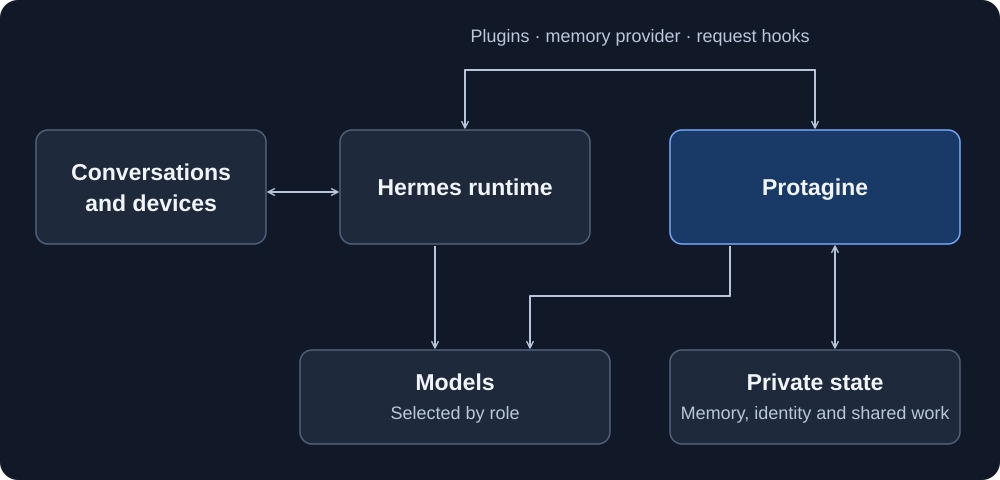

<picture>
  <source media="(prefers-color-scheme: dark)" srcset="docs/branding/protagine-primary-dark.svg">
  <source media="(prefers-color-scheme: light)" srcset="docs/branding/protagine-primary-light.svg">
  
</picture>

[](LICENSE)
[](https://github.com/Aevonix/Protagine/actions/workflows/ci.yml)

**Persistent memory and shared work for Hermes agents.**

Protagine keeps source-backed memory, corrections, identity and task state
outside the model. It connects to [Hermes](https://github.com/NousResearch/hermes-agent)
so an agent can use that state across conversations, channels and model changes.
Hermes owns conversations, tools, workers and scheduling. Each deployment keeps
its identity, credentials and device configuration private.

**Development status:** Phase 1 is not complete. Version 1.9.0 prepares
[official Hermes with packaged compatibility patches](docs/HERMES-HOOK-COMPATIBILITY.md).
The [known gaps](docs/KNOWN-GAPS.md) track unfinished behavior.

## How it works

| Part | Contribution |
| --- | --- |
| Persistent memory | Retains original evidence and its source, speaker and time. Corrections can supersede earlier information. Search indexes can be rebuilt without changing the originals. |
| Automatic recollection | Selects relevant memory before an ordinary reply. Later model requests check source validity and refresh the view of ongoing work. The agent can search explicitly or open the original evidence when it needs more context. |
| Shared work | Connects conversations to Hermes tasks, workers and schedules. The agent can inspect, steer or stop enrolled work while a separate conversation continues. |
| Identity and relationships | Stores preferences, contact links, appraisals and working judgments outside any one model. Owner corrections remain attributable. Relationship estimates are separate from access permissions. |
| Background deliberation | Reviews the agent's situation and proposes work through the existing initiative path. Its operating mode and cadence belong to the deployment. |
| Learning | Uses ordinary experience to improve remembered knowledge and preferences. Skill proposals, evaluation and rollback provide a path toward broader improvements. Reliable autonomous self-improvement remains a development goal. |



**Memory belongs to the agent, independently of the model.** SQLite holds
canonical source records in the minimum installation. Optional Lance indexes
add semantic retrieval. Memory can retain and reopen images, audio, documents
and selected video, with provenance linking derived descriptions to originals.
An embedding model change can replace an index without replacing the evidence.

**Models are replaceable processors.** Named roles select models for interaction,
reasoning, extraction, judging, vision and other functions, with configured
fallbacks. Local inference supports normal operation without a cloud model.
The model qualification suite records quality and latency for each tested role.
Its reports separate useful results from grounding failures and unknown outcomes.
Automatic fleet enrollment and selection from those measurements remain planned.

[Twelve frozen workflows](docs/FROZEN-WORKFLOWS.md) compare Hermes with and without
Protagine across restarts, corrections, task recovery and scoped handoffs.
They include controls where memory is unnecessary and record repeated attempts.

Memory extraction and admission review have separate task mappings. A deployment
can select their models and deadlines without changing the planning or judging
roles used elsewhere. Qualification records which role actually reviewed a memory.

**Deployment details stay private.** The guided setup attaches to an existing
Hermes profile. Identity, credentials, contact records, model addresses and device
settings stay outside the public repository. Voice systems, cameras, phones and
panels connect through deployment adapters. Consequential actions use owner
authorization, and missed notifications should leave work recoverable.

See the [architecture guide](docs/ARCHITECTURE.md) for storage ownership and
integration boundaries.

## Evidence and current status

The [paired benchmark](docs/PAIRED-AGENT-BENCHMARK.md) runs fresh Hermes and
Hermes plus Protagine installations against the same tasks. Its
[twelve frozen workflows](docs/FROZEN-WORKFLOWS.md) cover restarts, corrections,
recovery and scoped handoffs. Failed tasks remain in the results. Quality,
latency and incomplete resource accounting are reported separately.

The [source-recall experiment](benchmarks/source_recall/README.md) records one
measured retrieval improvement and its remaining failures. It does not establish
an overall advantage over Hermes. That claim requires completed paired evidence.

**Phase 1 is in development and validation.** The memory integration, source
readers, shared task controls, contact preferences, model roles and guided setup
are implemented. Limited trials have shown useful automatic recall and awareness
of work in other sessions. Corrections queued during a task's final answer
now continue into its next turn; controlled native gateway checks cover
this handoff. Consistent completion with live models still needs validation.

Reliability is unfinished. Models still add unsupported claims, delegated tasks
can stall, and consistent behavior across physical channels needs more evidence.
Complete forgetting across transcripts, unlinked copies and backups is unfinished.
Automatic persistent opinions are experimental and disabled by default. Useful
background initiative and autonomous self-improvement still need complete
demonstrations in ordinary use.

Internal-review probability measurement is experimental and disabled by
default. Explicitly enrolled reviews can measure first-attempt completion
against a frozen baseline. Live predictive benefit has not been demonstrated.
See [task forecasts](docs/TEMPORAL-FORECASTS.md) for its scope and limitations.

Until Phase 1 is validated, development releases may change interfaces and
storage layouts. The [known gaps](docs/KNOWN-GAPS.md) and
[changelog](CHANGELOG.md) describe the current implementation in more detail.

## Get started

You need Python 3.12, Git and one OpenAI-compatible chat endpoint. The minimum
profile does not require Docker, a graph database or an embedding model.

Protagine **1.9.0** includes the runtime installer. Install from this checkout:

```bash
python3.12 -m venv "$HOME/.local/share/protagine/venv"
source "$HOME/.local/share/protagine/venv/bin/activate"
python -m pip install ".[native-memory]" "./sidecar[hermes]"
protagine init --prepare-hermes
```

The wizard selects a Hermes profile and asks for identity, owner, model and
operating preferences. It preserves existing channel and model settings;
replacing an existing memory provider is an explicit choice. Accept its startup
option, or use your instance path:

```bash
protagine --instance /path/to/private/protagine start --detach
protagine --instance /path/to/private/protagine status
protagine --instance /path/to/private/protagine hermes run gateway run
```

Start a fresh Hermes session, provide a harmless fact and ask for it in another
session. Check the remembered source as well as the answer. The minimum profile
provides memory and work observation; background execution needs configuration.

The installer stages official Hermes plus versioned patches in a separate
environment. No fork is required. You can instead pass an existing official
`--hermes-python`; missing core interfaces trigger the same preparation.
Unknown revisions require a qualified update. Existing services switch through
their normal lifecycle; setup never restarts a running gateway. The
[setup guide](docs/LOCAL-HERMES-SETUP.md) covers profiles, services and updates.

Protagine includes **Deep Research** and **Skill Creator** skills. Hermes lists
their short descriptions and loads the instructions when needed. They use the
tools and models configured for that deployment.

## Research mission

We use **Proto-AGI** for the goal of a persistent agent that remembers what
matters, revises its judgments, keeps commitments and improves through
experience. The owner should be able to keep talking to it while it works,
correct it and inspect the evidence behind its actions.

Autonomy means initiating useful work within the deployment's authority.
Internal deliberation means reviewing events and unfinished tasks, then
producing a useful plan, memory or action. Neither another model call nor a
model's claim of success demonstrates learning. Improvements need independently
observed outcomes.

The approach keeps continuity outside model weights. Models can change and
serve different roles, provided each passes qualification for its work.
Broader intelligence and recursive improvement remain research goals.

## Roadmap

### Phase 1: a useful persistent agent

Completion requires useful outcomes on a real deployment, including ordinary
use and recovery.

| Outcome | What must work |
| --- | --- |
| Remember across models and channels | Apply a fact or correction from one conversation in another after a model swap, using the right evidence. |
| Maintain quality | Keep low-value material from crowding out useful memory. Handle contradictions, corrections and forgetting consistently. |
| Continue work during conversation | Inspect, redirect or cancel the same task from another enrolled channel without losing its state or permissions. |
| Use a coherent identity | Show how a stored preference or judgment changes behavior. Resolve uncertain contact identities before joining their records. |
| Recall beyond text | Recover useful information from supported media and reopen the relevant original. |
| Take useful initiative | Notice an opportunity or overdue commitment, take an authorized next step and follow it through without repeated alerts. |
| Improve a recurring failure | Diagnose a problem, evaluate a change on an independent task, demonstrate a benefit and recover from a regression. |
| Install, upgrade and recover | Set up a private agent and recover from service failures or updates with its memory, tasks and permissions intact. Qualify models for their actual roles. |

### Phase 2: improve the learning process

After Phase 1 is validated, improve how the agent selects, evaluates and retains
changes to skills, playbooks, prompts, retrieval strategies and non-core code.
It should learn which improvement methods work, choose better experiments and
use the results to make its next learning cycle more effective.

Recursive improvement requires showing that this process becomes more effective
over successive cycles. Model fine-tuning may be explored separately, but it is
not a prerequisite for the harness approach described above.

## Documentation

- **Memory:** [quality](docs/MEMORY-QUALITY.md),
  [model-swap demonstration](docs/MODEL-SWAP-DEMO.md),
  [semantic recall](docs/SOURCE-SEMANTIC-RECALL.md),
  [corrections](docs/SOURCE-ANNOTATIONS.md),
  [erasure](docs/NATIVE-REQUEST-ERASURE.md),
  [backup and recovery](docs/SOURCE-MEMORY-RECOVERY.md).
- **Media:** [images](docs/SOURCE-IMAGES.md), [audio](docs/SOURCE-AUDIO.md),
  [documents](docs/SOURCE-DOCUMENTS.md), [video](docs/SOURCE-VIDEOS.md).
- **Agent state:** [contacts](docs/SOCIAL-STATE.md),
  [working perspective](docs/WORKING-PERSPECTIVE.md),
  [judgments](docs/SELF-JUDGMENTS.md), [commitments](docs/COMMITMENT-WORK.md).
- **Execution:** [shared tasks](docs/NATIVE-TASK-CHANNELS.md),
  [accepted local work](docs/ACCEPTED-LOCAL-WORK.md),
  [model roles](docs/FUNCTION-ROUTING.md),
  [inference pool](docs/INFERENCE-POOL.md),
  [model qualification](docs/MODEL-QUALIFICATION.md).

## Development

```bash
python -m pip install -e './sidecar[dev]'
cd sidecar
python -m pytest -q tests protagine
```

`tests/hermes_adapter` checks built packages against official Hermes plus the
patches shipped in that same build. CI also runs the native patch regressions.
Deployment validation also needs real inference, attributable sources, work
across sessions and recovery with the actual configuration. Keep private data,
credentials and deployment configuration out of public commits and examples.

## Branding

Protagine is a project from [Aevonix Research](https://aevonix.com).
The [Protagine logo kit](https://aevonix.com/brand/current/protagine-logos.zip)
includes SVG, PDF and PNG artwork. See the
[brand guide](https://aevonix.com/branding) for colors, spacing and usage,
or the [repository asset notes](docs/branding/README.md) for the files used here.

## License

[MIT](LICENSE). Optional dependencies retain their own licenses.
