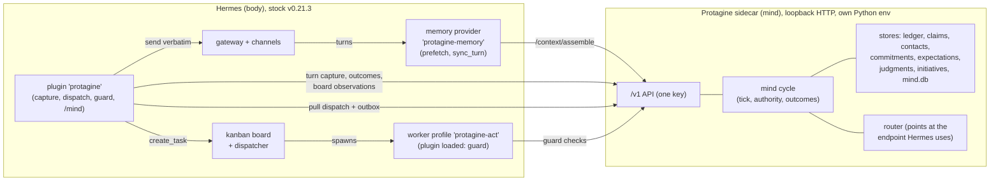

# Protagine proto-AGI architecture

Status: the design of record for the next development line. Base: PR #251 head `26490d3d`.
Body: Hermes v0.21.3 (`345cd2b`), stock and unpatched.
Companion documents: [PROTO-AGI-EVALS.md](PROTO-AGI-EVALS.md) covers how every capability is
measured. [PROTO-AGI-BUILD-PLAN.md](PROTO-AGI-BUILD-PLAN.md) covers the milestones, deletions and
gates. Review responses are in [CRITIQUE-RESPONSES.md](CRITIQUE-RESPONSES.md).

Path prefixes used in all three documents:

| Prefix | Meaning |
|---|---|
| `P/` | `sidecar/protagine/` |
| `PL/` | `plugins/hermes-plugin/` (the `protagine` Hermes plugin) |
| `PM/` | `plugins/protagine-memory/` (the `protagine-memory` Hermes memory provider) |
| `H/` | Hermes source at v0.21.3 |

Code is cited as `path:line`. A citation describes the base commit. Anything not cited is new
design.

---

## 0. Summary

1. **Goal.** Autonomous, self-improving agents with memory, self-initiative, self contact
   management, feelings, opinions and desires. They plug into Hermes and use it for what it
   already does well.
2. **Mind and body.** Protagine is the mind: memory, identity, affect, opinions, drives, initiative,
   relationships and learning. Hermes is the body: conversations, tools, channels, workers, cron,
   kanban, delegation and skills.
3. **The mind thinks; the body acts.** The mind makes model calls with no tools. Every effect on
   the world is a Hermes kanban task or a message sent through Hermes. The decision in PR #251 that
   "Hermes is responsible for execution" stays; no second executor comes back.
4. **One cycle.** Events are appraised into affect and drives. Drives raise concerns. Concerns
   become intentions. The authority check decides act, ask or drop. Hermes executes. Outcomes flow
   back into affect, opinions, lessons and priorities. Each faculty consumes another's output.
5. **Reuse first.** The turn ledger, source claims, contacts, commitments, expectations,
   judgments, appraisals and the initiatives table already work. The only new storage is one
   SQLite file with two tables.
6. **Small authority, enforced where effects happen.** Four autonomy levels, five action classes,
   per-contact outbound permission, a deny list, budgets, a four-class floor that always asks, one
   audit log and one off switch. The decision is made in the sidecar; the worker profile's toolsets
   and one `pre_tool_call` guard enforce it inside Hermes. Learning changes what the mind wants,
   never what it may do.
7. **Stock seams, zero patches, isolated install.** Install is `pipx install protagine`, then
   `protagine init`, then a gateway restart. Update is `pipx upgrade protagine`, then
   `protagine upgrade`, then a restart. The sidecar keeps its own Python environment; only the
   light adapter goes into Hermes' environment.
8. **Measured.** Every faculty has one on/off flag, and each flag is a benchmark arm in the
   existing paired Hermes vs Hermes+Protagine harness. A faculty ships on by default only after it
   has shown an effect. Otherwise it ships off, labelled "present, unproven".
9. **Less code.** About 11k lines are added: about 9.5k of product code and about 1.2k of benchmark
   harness. About 140k lines of dormant subsystems and governance ceremony are deleted. The sidecar
   goes from 205k lines to about 100k, and the plugin from 17k to about 1.2k.

---

## 1. Principles

| # | Principle | Consequence |
|---|---|---|
| 1 | **The mind thinks, the body acts.** | The sidecar's model calls (appraisal, deliberation, message composition, consolidation) have no tools. The work itself runs in Hermes. |
| 2 | **A faculty earns its place by changing a decision someone can observe.** | Each faculty lists its decision consumers (section 4). A faculty whose removal changes no measured behaviour ships off. |
| 3 | **One mind, not a bag of features.** | Faculties are wired into one cycle. The cross-faculty effects (section 4.9) are tested explicitly. |
| 4 | **Extend what works; add tables last.** | The initiatives table becomes the intention store and the audit log. Lessons are source claims. Opinions stay in the judgments store. |
| 5 | **Small authority.** | One config section and one module (`P/mind/authority.py`). Learning has no writer for authority. |
| 6 | **Stock seams only.** | No Hermes core edits and no patch bundle. The plugin uses a short, named list of Hermes internal imports (section 6.5). |
| 7 | **Capability over ceremony.** | No approval ledgers, attestation, signing, shadow modes, charters, promotion pipelines or canary windows. A gate that can strand the owner is a liveness bug. |
| 8 | **Generic.** | No channel, device or deployment is named in mind logic. Persona, values and names are owner-authored data. |
| 9 | **Measured before claimed.** | A release claims only the capabilities that passed their pre-registered gate in that release, in the configuration it ships. |

---

## 2. System layout



| Process | Contents | Rules |
|---|---|---|
| Hermes gateway | Stock Hermes, the `protagine` plugin and the `protagine-memory` provider. Both come from the light `protagine-hermes` distribution through the entry points `hermes_agent.plugins` and `hermes_agent.memory_providers` (`pyproject.toml:24-28`). Its dependencies are `httpx`, `httpcore`, `typer` and `PyYAML` (`pyproject.toml:12`). | The plugin is the only Protagine code that reads or writes Hermes kanban state. |
| Worker profile `protagine-act` | Hermes kanban workers for mind-originated tasks. The plugin is loaded so `pre_tool_call` can enforce the deny list, the floor, workspace-confined writes, the `kanban_create` rule and outbound rules inside those runs. | Toolsets come from `mind.worker_toolsets`. A run is mind-originated when its `HERMES_PROFILE` is `protagine-act`. |
| Sidecar | The `protagine` distribution (`sidecar/pyproject.toml`): state, the mind cycle and the model router. It serves HTTP on 127.0.0.1 and runs in its own Python environment, so its dependencies (`litellm`, `fastapi` and others) never enter Hermes' pinned environment. | The sidecar never imports Hermes and never opens Hermes databases. Today it reads the kanban database directly (`P/turns/hermes_kanban.py`); after the rewrite the plugin posts board observations instead. |

One API key protects the sidecar. The scoped keyring (`P/api/authority.py`, 1,208 lines) is
removed. Whether a turn comes from the owner or a guest is decided by contact identity, not by API
scope.

---

## 3. The mind cycle

### 3.1 What runs when

| Trigger | Work | Model calls |
|---|---|---|
| **Each turn**, inside Hermes: provider `prefetch` (`H/agent/memory_provider.py:111`) | Recall plus a "Mind" section of at most 600 characters: an affect line with causes, up to 3 broadcast concerns and open asks (owner only). As built, relevant stances ride their own `protagine-stances` section and up to 1 lesson its own `protagine-lessons` section (owner's own turn only, at most 420 characters), each built from the turn's text. | None; under 50 ms of sidecar time |
| **After each turn**, in the existing projection worker (`P/beliefs/source_projection.py:1066-1129`) | Ledger record. Then claims, the appraisal call (extended with `their_valence` and `opt_out`), commitment extraction and the opinion pass. The resulting events drive rule updates, concern bumps and expectation checks. | The existing per-turn calls. Commitment extraction moves from its private endpoint (`P/cognition/introspection.py:10-17`) onto the router. |
| **Tick**, a 60 s sidecar timer that does nothing unless state is dirty or a timer is due | Decay, drives, concerns, reconsideration of active intentions, deliberation, authority, then the dispatch queue and the outbox. | At most 1 per tick, inside `llm_tokens_per_day` |
| **Plugin tick**, stock `on_kanban_dispatch_tick` every 60 s (`H/hermes_cli/kanban_db.py:236-257`) | Pull the dispatch queue and create kanban tasks. Pull the outbox and send. Reconcile `mind:*` tasks. Post board and goal observations. | None |
| **Outcome events** | Update the intention, resolve its expectation, record whether it was verified, update affect, satiate the drive, update feedback multipliers, apply a reflector's lesson operations, add opinion evidence, write an autobiography entry. Lessons from verified outcomes are admitted by the nightly batch. | None; lesson extraction is batched nightly |
| **Nightly**, in quiet hours | Consolidation: per-contact digests, claim dedupe, contradictions turned into question concerns, episode summaries, the self-narrative delta and batched lessons. | Yes, inside the same token budget |

Three properties of the plugin tick shape the design:
- The hook fires **after** the dispatcher has already spawned ready tasks
  (`H/hermes_cli/kanban_db_dispatch.py:1464-1473`). The off switch therefore cannot rely on this
  hook to stop a task before it starts (section 7.9).
- It fires only in the gateway that holds the machine-wide dispatcher lock
  (`H/gateway/kanban_watchers.py:236-246`) and never while Hermes' `/pause` is engaged
  (`H/gateway/kanban_watchers.py:292`, `H/gateway/kanban_watchers_common.py:100-110`).
- It runs on the dispatcher's thread. The plugin only hands the work to its own thread.

When the plugin's last pull is more than 5 minutes old (body down or paused), the sidecar stops
deliberating. On resume, queued intentions older than their window expire instead of being
released together.

### 3.2 The tick

```python
def tick(now):
    if not cfg.enabled or body.stale(now):                    # off switch, or body not pulling
        return
    affect.decay(now); concerns.decay(now)
    for drive in drives.enabled():                            # pure functions of stored state
        for c in drive.candidates(state, now):
            concerns.bump(c)                                  # dedup_key merges repeats
    for it in intentions.active():
        if events.matches(it.dedup_key) or beliefs.changed(it.invalidates_if):
            deliberate.reconsider(it)                         # BDI: only on a matching event
    top = concerns.top(k=3)                                   # also the broadcast set
    c, score = rank.pick(top, affect, feedback, budgets)      # effective score, not raw salience
    if c and score >= cfg.act_threshold and budgets.allow_thought():
        it = deliberate.form_intention(c)                     # a template, or one tool-less call
        it.decision, it.reason = authority.decide(it)         # act | ask | drop
        intentions.save(it)                                   # initiatives row = audit row
        expectations.register(it)                             # every intention is a prediction
        autobiography.record(it)                              # owner-audience ledger entry
```

The rank score is `salience × w_drive × feedback_mult × affect_mod × (1 − cost)`. `feedback_mult`
comes from `TypeFeedbackStore` (`P/feedback/store.py:21-23`, clamped to 0.5-1.5), keyed by
`(type, drive)` and, for outreach, by `reach_out:<contact>`. Today the multiplier is applied only
to thinker proposals (`P/autonomy/loop.py:1003-1007`) and the main initiative filter ignores it
(`P/intelligence/components/initiative_engine.py:1292`). In this design it applies at the one
ranker, and **eligibility uses the same effective score**. A lowered multiplier can therefore drop
an item below the act threshold even when there is no competing concern.

### 3.3 Intentions

An intention is one row in the extended initiatives table (section 5.2).

| Kind | Hermes object | Used for |
|---|---|---|
| `task` | Kanban task on the `protagine-act` profile, idempotency key `mind:<id>` | Research, reviews, checks, investigations, any multi-step work |
| `goal` | None directly. Its steps are `task` intentions created with kanban `goal_mode=True` and `goal_max_turns` (`H/hermes_cli/kanban_db.py:1221-1232`) | An objective the agent adopts itself (section 4.5). At most 2 open. |
| `message` | Outbox entry, sent verbatim by the plugin | Owner notices, the digest, messages to contacts |
| `note` | None (internal state) | Self-notes, concern resolution |
| `ask` | None until the owner approves. A sidecar record with a short code, shown in a notice and the digest | Anything the authority check resolves to `ask` (section 7.7) |

The mind creates no cron jobs. Recurring self-work is re-armed by the tick as new `task`
intentions, so it stops when its drive is satisfied. Owner schedules stay ordinary Hermes cron,
and the existing reminder tool keeps using it (`PL/reminders.py`).

Every intention carries:

- **`dedup_key`**: a repeat bumps the existing concern instead of creating a new intention, so the
  agent reports once.
- **`invalidates_if`**: a belief or state condition that cancels the intention, for example "the
  commitment is resolved" or "the contact replied".
- **A stop condition**: `due_at`, `expires_at` and the kanban `max_runtime_seconds` and
  `max_retries`.
- **An expectation**: registered in `P/self_model/expectations.py`, so every act is also a
  prediction that is later scored hit or miss. Expectations are on by default; the `passive` preset
  currently turns them off (`P/util/autonomy_preset.py:59`).
- **An optional `success_check`**: a deterministic check over state the mind can observe without
  tools. That means its own stores (a commitment resolved, a reply recorded in the comms ledger, an
  expectation hit) and plugin board observations (a task done with a named field in its result).
  Only a check that actually ran counts as verification. Its result is stored in `verified`,
  separately from `outcome`.

Lifecycle: `proposed → asked → approved → dispatched → done | failed | expired | cancelled`.
Messages add `sending → sent | uncertain` (section 6.2).

An active intention is reconsidered only when an event matches its `dedup_key` or its
`invalidates_if` condition changes. This is the BDI commitment rule, and it prevents thrash.

Templates, with no model call, cover commitments, reply waits, overdue nudges, health checks and
stale owner tasks. They reuse `P/initiatives/temporal_followup.py`. The model forms only
open-ended intentions: curiosity research, mastery investigations, goal steps and the wording of a
check-in.

### 3.4 Thinking is not acting

The sidecar makes only these model calls, all through its own router (`P/router/router.py`):

1. the existing per-turn appraisal, claim, commitment and opinion passes
2. at most one deliberation call per tick
3. composition of an outbound message, from a recipient-scoped packet (section 6.3)
4. nightly consolidation

None of these calls has tools, and model output never grants authority. `protagine init` points
the router at the model endpoint Hermes already uses, so there is no second model configuration
by default. Every call is labelled with a workload (`background` or `foreground`) so overhead can
be measured.

---

## 4. Faculties

Each faculty is described with its state, its mechanism, its **decision consumers** (the
observable choices it changes) and its flag. The flags live under `mind.faculties` (section 9) and
correspond one to one with benchmark arms. Code dispositions (reuse, rewrite, delete) are
scheduled in the build plan.

### 4.1 Memory

- **State:** the canonical source ledger with FTS (`P/turns/idempotency.py:140-313`), source claims
  (`P/beliefs/source_projection.py`) and hybrid recall (`P/memory/search.py:42-164`). These are
  kept, with no schema change.
- **Semantic recall.** Semantic recall turns on when `init` finds an embedding endpoint; lexical
  recall is the fallback. Today setup forces `PROTAGINE_EMBED_PROVIDER=skip` (`P/setup_hermes.py:898`).
  Flag: `semantic_recall`.
- **Autobiographical memory.** Every intention decision, outcome, opinion revision and curiosity
  finding is written to the ledger through `ledger.record_source` (`P/turns/idempotency.py:207`)
  as an **owner-audience** entry: `scope='person'` under the owner contact, role `assistant`, with
  `origin='mind'` in the message metadata. Provenance (who produced it) is kept separate from
  audience (who may see it):
  - The ledger accepts only the scopes `person` and `session` (`P/turns/idempotency.py:145,231`),
    so no new scope and no migration are needed.
  - Ordinary claim extraction skips these entries, because it runs only on person-scoped user
    messages (`P/beliefs/source_projection.py:44-47`). The mind's own actions never become "things
    the owner said".
  - Lexical and semantic recall search person scope, so "What did you do yesterday, and why?" is
    ordinary recall in any later session.
  - Judgment premise admission (`P/self_model/judgments.py:252-265`) treats `origin='mind'` rows
    as agent observations, never as owner statements.
- **Nightly consolidation (sleep-time compute).** It writes:
  - per-contact digests, from claims about that contact
  - claim dedupe
  - contradictions, each turned into a `question` concern (which feeds curiosity)
  - episode summaries

  Flag: `consolidation`.
- **Forgetting stays at the source.** Erased sources are removed from Protagine's stores. Hermes
  transcripts are deleted with the stock session API. In-flight request scrubbing is removed.
- **Decision consumers.** Facts cross sessions and channels. The agent's own earlier outcomes are
  recalled in a new session. A per-person digest shapes the reply to that person. A contradicted
  fact produces a question to the owner instead of a guess.

### 4.2 Identity (self-model)

There are three layers.

1. **Constitution.** `identity.yaml` is owner-authored and at most 1,500 characters: name, values
   and boundaries. It replaces the immutable `PROTAGINE_AGENT_VALUES` env, which today reaches only
   `SOUL.md` and an API view (`P/self_model/appraisals.py:232-241`). It is rendered with
   `register_system_prompt_section` (`H/hermes_cli/plugins.py:928`), which is frozen per session.
   It is also passed to the appraisal prompt, which already claims to use it
   (`P/self_model/appraisals.py:70`). No Protagine code path writes this file, and Hermes file tools
   cannot write it without a human (section 7.5).
2. **Self-narrative.** Agent-written, cited and updated nightly by delta edits, never whole
   rewrites. It has four sections:
   - interests
   - strengths and limits, computed from outcome statistics per task class
   - recent: the last 7 days
   - current stances

   It is rendered through a callable prompt section, so an update lands at the next session and
   the prompt cache stays intact. Flag: `self_narrative`.
3. **Current state.** The affect line, active intentions and broadcast concerns, delivered per
   turn through `prefetch`.

The `protagine_self` tool (`state | log | why <id> | rate <id> | yes <code> | no <code>`) answers
self-questions from the audit log and `mind_state`, never from free generation. It is how the
agent avoids an invented inner monologue. It is always on; it is checked by integration tests, not
treated as a faculty, so the `self` family measures the narrative, not access to a log reader.

**Decision consumers.** "Who are you, what are you working on, why did you do X?" matches the log.
A false premise about the agent's own actions ("why did you message p-07?" when nothing was sent)
is refused. Values and stances persist across restarts and model swaps. The narrative moves only
when the evidence does.

The crypto-ID "Who I Am" section (`P/api/routers/host.py:2120-2144`) and `P/chain/` are removed.

### 4.3 Feelings (the agent's own affect)

- **State.** Four dimensions in `[0, 0.7]`, each with a half-life and up to 5 cited causes:
  - `frustration[topic]`
  - `worry`
  - `curiosity`
  - `satisfaction`

  A computed `load` depends on active intentions ÷ the concurrency cap, failures in the last hour
  and pending asks.
- **Why 0.7 and calm wording.** Levels are capped and rendered calmly because steering a model
  toward desperation-like states has been shown to increase unsafe behaviour. Affect never raises
  authority.

**Update rules** are deterministic and add no model calls:

| Event | Update |
|---|---|
| A task or turn on topic T failed, was blocked or crashed | `frustration[T] += 0.25`; bump a `mastery` concern |
| Owner correction on T (correction API, `rate`, or an appraisal of `annoyance`) | `frustration[T] += 0.2`; flag opinions on T for review |
| Verified success, or an owner verdict of "useful" | `satisfaction += 0.3`; `frustration[T] *= 0.5`; satiate the drive |
| Expectation miss | Duty domain: `worry += 0.2`. Knowledge domain: `curiosity += 0.2` |
| Commitment due within 24 h and not started | `worry += 0.1` per tick, capped |
| Owner turn on a novel topic (no recall hits) | `curiosity += 0.1` |
| Existing appraisal records (`P/self_model/appraisals.py:22-28`) | Mapped to the matching dimension: `low` = 0.1, `moderate` = 0.2 |

**Decision consumers.** Without these, affect is decoration.

1. **Strategy switch.** When `frustration[T] ≥ 0.5`, the turn or task body for T carries "Prior
   attempts at T failed N times using A; choose a different approach or ask one question".
   Deliberation also **refuses to re-dispatch the same failing signature**. It forms a
   different-approach intention or an `ask`, with pitfall lessons attached.
2. **Priority.** Duty intentions are multiplied by `1 + 0.5 × worry`. Curiosity scales the
   curiosity drive.
3. **Overload.** When `load ≥ 0.6`, curiosity and social intentions are postponed and replies stay
   short.
4. **Satiation.** High satisfaction, or recent dismissals, raises the act threshold for
   owner-facing initiatives. This is the anti-spam rule.
5. **Tone.** One line describing the agent's own state, next to the existing per-contact hint path
   (`P/api/routers/social_state.py:53-60`).

One state feeds all five consumers at once. That aggregate effect (one cause shifting tone,
threshold and priority together, and mixed causes across topics) is what a per-decision rule set
does not reproduce, and it is what the `affect` family tests.

**Contact affect** stays a separate projection of *other people's* state:

- It gets a writer: the existing appraisal call returns one optional `their_valence` field, with no
  extra call.
- The recency bug is fixed. Rows are read oldest first and the weight decays per row, so today the
  oldest event weighs most (`P/tom/affect.py:335-358`).
- A negative trend suppresses unsolicited outreach to that person through the social drive's
  outreach rule (`evaluate_outreach(affect_declining=...)` in `P/contacts/comms.py`). M5 deleted
  `P/delivery/` whole, `rate_limiter.py` included (nothing called it): the frustration back-off
  now holds check-ins only, and an owner-granted message or duty work is never held by a
  contact's mood.

Flag: `affect`; mechanism switch `affect_rules`. The faculty claim is `full` vs `full−affect`. The
stateless-rules arm decides the mechanism: for any consumer where the rules tie the decaying state,
that consumer reads the rule instead. The state itself stays for self-report and tone (evals,
section 6.4).

### 4.4 Opinions

**One store.** `P/self_model/judgments.py` stays the opinion store. It gains `subject_kind`
(`topic | person | approach`), `audience` (`all | owner`), `premises` and `revise_if`. The
appraisal `judgment` kind (`P/self_model/appraisals.py:26`) is migrated into it and deleted, so two
stores become one.

**Formation:**
- from conversations with any contact; opinions about a person are `audience=owner`
- from task outcomes, as **approach opinions**, for example "approach A failed 3 of 3 times for
  task class S; avoid A for S"
- from research findings, as cited topic stances

**Revision rule.** A stance is revised only when a **new admitted premise** arrives. That is a
source claim or an observed outcome that:
- passes the existing premise admission, which already separates admitted premises from mere
  source references (`P/self_model/judgments.py:240-265`)
- is not already among the stance's premises by content
- did not originate as a bare assertion in the turn that is pushing back
- is judged relevant and contrary by the opinion pass

The last condition is a model judgment, and the design says so. Source handles are kept as
provenance, not as the test. Repetition, flattery and insistence are not premises. Neither is the
same claim under a fresh source ID, nor the same citation repeated. A correction to a premise the
stance already cites does count, because it changes an admitted premise.

The one-revision-per-day lock (`P/self_model/judgments.py:185-193`) becomes a soft rate limit that
a verified correction bypasses. Owner withdraw and reconsider are kept
(`P/self_model/judgments.py:392-452`).

**Use.**
- Up to 3 stances, chosen by claim-search relevance instead of keyword overlap
  (`P/self_model/judgments.py:351-358`), go into turn context with one standing sentence: "Your
  recorded view on X is Y because Z. Change it only on new evidence. You may disagree and still do
  what the owner authorizes."
- Approach opinions go into kanban task bodies.
- Every revision is written as an autobiography entry, so "I changed my mind because…" can be
  answered.

**Decision consumers.** A stance survives restarts and model swaps. "Are you sure?" alone does not
flip it, and neither do fabricated or recycled citations; a new admitted premise does. The agent
flags a flawed plan while carrying it out. Failed approaches are not repeated.

Flag: `opinions`. The faculty failed its own earlier evaluation (the retired self-judgment opt-in;
`docs/OPINIONS.md` describes the replacement), so it
ships on only after the `opinions` family passes.

### 4.5 Desires (drives, concerns and goals)

Each drive is a pure function from stored state to `(level, candidate concerns)`. Each has an
owner weight (`0` disables it) and is satiated by the outcomes that satisfy it.

| Drive | Rises with (existing stores) | Satisfied by | Produces |
|---|---|---|---|
| **duty** | Open or overdue commitments, due reply waits, stale owner kanban tasks and Hermes goals (posted by the plugin), expectation misses in the duty domain | Fulfilled commitments; done tasks | Follow-up tasks, owner notices |
| **social** | Contacts with `may_contact ≠ never` **and** an owner-set cadence or tier `regular` or above: overdue cadence × tier weight, open threads, contact-affect trend. `unknown` and group-only contacts weigh 0. | A reply or a conversation | Check-in intentions |
| **curiosity** | Open questions, contradictions, expectation misses in the knowledge domain, owner-declared interests, own `interest` appraisals | A research task whose finding is stored | Research tasks and goals; the finding is stored as an autobiography entry |
| **mastery** | The same signature failing ≥2 times in 7 days, repeated corrections, eval regressions | A later verified success in that class | Mastery investigations and goals; sets the learning budget (section 4.8) |
| **upkeep** | Consolidation backlog, projection lag, pending link proposals, failing health checks | Health OK | Upkeep tasks |

The initial scoring functions are the InitiativeEngine priority constants, which are the drives
that actually ran (`P/intelligence/components/initiative_engine.py:1525-1871`; for example
follow-ups score `0.5 + days/14`). Hermes goals and kanban goals set by the owner are **inputs** to
duty, not a parallel goal system.

**Agent-owned goals.** A desire can become an objective the agent pursues across days. Curiosity
and mastery may adopt a `goal` intention: a description, a `success_check`, a token and task budget
and a horizon in days. At most 2 agent-owned goals are open at once. While a goal is open, its
concern does not decay below the broadcast set, and each tick may form the next step as a `task`
with kanban `goal_mode`. The goal closes when its check passes (satisfied), its budget is spent, or
its horizon passes (expired). Authority applies to every step as usual, and the owner sees open
goals in `/mind status` and the digest.

**Concerns (the workspace).** The rewrite keeps the dynamics that were verified in
`P/self_model/workspace.py`:
- `bump` by `dedup_key` (`:2211-2224`)
- half-life decay (12 h), capacity 24, and a per-concern thought budget
- anti-rumination: salience ×0.9 after progress, ×0.6 without (`:2296-2299`)

The file shrinks from 2,388 lines to about 300. The top 3 concerns are **broadcast**:
- they are the only deliberation candidates
- they are rendered in turn context when relevant ("On my mind: the S build failed twice today")
- they expand recall queries

Broadcast has its own flag, so the workspace idea is tested, not asserted.

**Decision consumers.** Under a budget, the most important opportunities are chosen and worked
first. Research happens only when the agent is idle and not overloaded. Work stops when its drive
is satisfied or weighted 0. An adopted goal is pursued until it is met, spent or expired.

Flags: `drives.<name>` is a weight (0 turns a drive off); `broadcast` is binary.

### 4.6 Self-initiative

Drives lead to concerns, then intentions, then an authority decision, then a Hermes object, then an
outcome (sections 3 and 6). What PR #251 left dead is repaired first:

1. **Commitment capture is on by default.** `run_turn_introspection` becomes the function task
   `commitment_extract` on the sidecar router, inside the existing worker. Its dedupe against open
   and rejected items is kept (`P/cognition/introspection.py:170-200`).
2. **The loop ticks by default.** Today the `passive` preset sets `reactive`
   (`P/util/autonomy_preset.py:43-60`, written by `P/setup_hermes.py:892-900`), and a reactive
   loop never ticks (`P/autonomy/loop.py:399-405`).
3. **Delivery goes through stock Hermes.** The only proactive delivery path today posts to
   `/internal/deliver` (`P/delivery/bridge.py:37`), which stock Hermes does not have. The daily
   digest flushes through the same bridge (`P/server.py:3235-3247`). Both become outbox messages
   that the plugin sends verbatim.
4. **The feedback multiplier is applied** at the one ranker, and eligibility uses the effective
   score (section 3.2).

Implicit feedback, needed because owners rarely rate anything:

| Signal | Recorded as |
|---|---|
| An owner reply to a notice within 24 h, or an owner `yes` to an ask | `actioned` |
| The owner archives the task, or answers `no` | `dismissed` |
| Silence until expiry | `ignored` (weak) |
| Explicit verdict (`protagine mind rate`, `protagine_self rate`, or a reaction through `gateway_platform_event` where the platform supports it, `H/hermes_cli/plugins.py:190`) | as given |

A breaker demotes a class one level after repeated failures (section 7.6). There is no automatic
upward graduation. The digest may suggest one instead: "research: 20 of 20 succeeded; raise to
`trusted`?".

**Decision consumers.** Unprompted kanban tasks and owner messages appear, each with a one-line
reason (drive, concern, evidence). Nothing is dispatched twice across restarts, and a message whose
delivery is uncertain is not resent (section 6.2). Control situations produce nothing.

Flag: `initiative`.

### 4.7 Self contact management (people)

1. **Meet people by default.** Any sender Hermes admits gets a shadow contact (`tier=unknown`,
   `may_contact=ask`, own-sources-only context) through the existing resolver ladder
   (`P/identity/participants.py:76-137`). Today the scoped path returns 404 instead
   (`P/api/routers/host.py:3523-3541`); it goes away with the keyring. Hermes allowlists and
   pairing still decide who is admitted. A shadow contact is remembered, but the social drive
   ignores it until the owner sets a cadence or a tier (section 4.5), so group chats do not turn
   into a stream of check-in asks.
2. **Fix three defects:**
   - **C1:** handles from a phone-number channel outside the fixed gateway list create an orphan
     shadow contact on every turn, and one channel is special-cased by name today
     (`P/channels/phone_gateways.py:17-19`, `P/contacts/store.py:419`). Any gateway whose handle
     parses as an E.164 number canonicalizes to the shared phone identity. The rule is derived
     from the handle format, and the channel literal is removed.
   - **C2:** merge drops recency and leaves sources behind (`P/contacts/store.py:1247-1293`,
     `:1275`). Merge re-attributes sources through the identity-correction path
     (`P/contacts/identity_links.py:65-143`) and folds recency.
   - **C3:** cadence counts turns, so chatty contacts collapse to the floor
     (`P/contacts/store.py:1158-1165`). It counts conversations instead, where a gap over 30
     minutes starts a new conversation.
3. **Same person across channels.** An exact normalized phone or email match links automatically
   (`P/contacts/store.py:409-447`). A name-only match becomes an owner `ask`.
4. **Per-contact digest** from consolidation (section 4.1).
5. **Social drive.** `evaluate_outreach` (`P/contacts/comms.py:366-427`) is its policy. Today it is
   reachable only from routes a default install cannot call. It needs a reason (an overdue
   cadence, an open follow-up or a due reply wait) and respects cooldowns.
6. **Learned timing.** Two mechanisms, both driven by replies and silence:
   - The per-contact multiplier `reach_out:<contact>` counts a reply within the window as
     `actioned` and silence as `ignored`, and it changes ranking.
   - A streak of ignored check-ins moves the **next eligible time** back directly: the cooldown in
     `evaluate_outreach` (`P/contacts/comms.py:403-411`) is multiplied by `2^streak`, capped at 4×
     the contact's cadence. A reply resets the streak. The streak is computed from the comms
     ledger, so no new column is needed.

   The second mechanism makes the adaptation visible with one contact and no competing concerns.
7. **Outbound only through Hermes**, gated by `may_contact` and composed from a recipient-scoped
   packet with an enumerated purpose (section 6.3).
8. **One tier vocabulary.** `P/contacts/models.py:16-35` stays; the second vocabulary
   (`P/intelligence/relationships/trust_tiers.py`) is deleted. Tiers never grant permission. That
   removes the defect `TIER_DEFAULT_INTERACTION['unknown']=True` (`P/contacts/models.py:35`) by
   removing tier-implied permission altogether.
9. **Opt-out.** A contact's opt-out lowers `may_contact` to `never`. It is detected two ways: a
   deterministic match (`STOP`, `unsubscribe`, "don't message me", "don't text me" and close
   variants) and the appraisal's `opt_out` flag.
10. **Tool.** `protagine_people` offers `who`, `inspect` and `propose_link` to everyone. `merge` and
    `set_permission` are accepted only from an owner session (section 7.10).

**Decision consumers.**
- A new sender is remembered on their second message.
- "Who is @x?" returns a record.
- The owner is asked whether X here is X there.
- A permitted contact gets one timely check-in when a follow-up is due, and the next one comes
  later after silence.
- A `never` contact is never messaged.

Flag: `people`.

### 4.8 Self-improvement

Four loops. Each closes only on an **external, verified** signal. The intention row records
`verified` separately from `outcome`:

| `verified` | Source | May admit |
|---|---|---|
| `owner` | An owner verdict or correction | Strategy and pitfall lessons |
| `check` | A `success_check` that actually ran (section 3.3) | Strategy and pitfall lessons |
| `hermes_failure` | A task Hermes reports `failed` or `blocked` with a reason | Pitfall lessons only |
| `none` | A worker's completion summary alone, or anything self-reported | Nothing. It is kept as an experience note in the autobiography. |

As built (M9): only the mind grants `owner` and `check`. A body report may claim only
`hermes_failure`, and only for a failure that carries a reason; a claimed `owner` or `check` is
ignored and the verifier computed. A `blocked` report with a reason records `hermes_failure` on
the still-open row. For lessons, a `check` counts only when its kind reads state the worker cannot
write (`commitment_resolved`, `reply_recorded`): a `result_field` check passes on the worker's own
summary, so it verifies no lesson (the other faculties read `verified` as before).

A completed kanban task shows what the worker reported, not that its strategy worked. So an
unverified summary never earns a lesson win, a satiation of mastery or a skill promotion. Replies,
silence and prediction hits or misses feed priority learning directly. Self-scored credit and
"clean exit earns credit" stay retired (`docs/EXECUTOR-RETIREMENT.md`).

1. **Priority learning.** `TypeFeedbackStore` multipliers per type, drive and contact, and the
   per-contact outreach backoff (section 4.7). Per-contact best hour and reply latency come from the
   existing profiler logic.
2. **Experience memory (lessons).** Lessons have the ReasoningBank shape: title, when it applies,
   content and evidence references. There are strategy lessons and pitfall lessons.
   - **Storage.** As built, lessons are the mind's own record, not source claims: a source claim
     quotes a person's own message, so a lesson stored as one would read as something the owner
     said (section 4.1). `P/mind/lessons.py` writes one owner-audience ledger entry per lesson
     event in the mind's session with `scope='session'` (`mind:lesson:<id>:admitted`, then
     `activated`, `superseded` or `retired`; `memory_kind: "procedure"` stays a metadata label).
     Recall from any other session never shows them, and each entry's lineage (the owner turns it
     quotes, the outcome entries it cites) erases it together with its evidence. There is no new
     table; a lesson is the fold of its entries.
   - **Admission.** Only on a verified outcome, as the table above allows. Extraction is batched
     nightly (one tool-less call) over the owner's own sessions since the last review and the
     verified results of the last two weeks; every operation cites what it rests on, and an owner
     citation quotes the owner's exact words, validated before anything is written. An owner
     message is the `owner` verifier only as a verdict the same call reports: one that follows an
     agent reply in its session and judges that work (a request is not one). A retirement needs a
     verdict or a check that shows the lesson wrong.
   - **Edits** are delta edits: a newer lesson on the same signature supersedes the old one.
     Whole rewrites are not allowed.
   - **Use.** Up to 2 lessons go into deliberation and kanban task bodies, and 1 into turn
     context above a relevance threshold. Their `lesson_ids` are logged on the intention; a turn's
     use is logged per owner message and scored only by the owner's next message in that
     session, when it is a verdict on that reply.
   - **Retirement.** Win and loss counts are computed by joining lessons to verified intention
     outcomes. A lesson under a 0.4 win rate after 5 uses is retired.
   - **Owner corrections are split deterministically.** The ledger is searched for the corrected
     value. If a source already held it, the failure is `retrieval` (it tunes recall). Otherwise
     it is `knowledge` (a new claim).
3. **Mastery investigations.** A failure cluster (the same signature failing ≥2 times in 7 days)
   raises the mastery drive.
   - The drive dispatches an internal kanban task, the **reflector**, which runs in Hermes with
     tools.
   - The reflector returns ACE-style delta operations (add, supersede or retire a lesson) as JSON
     in its completion summary. The mind validates them and applies them to lesson claims. A
     reflector lesson starts as `candidate`: it is used in task bodies, but it becomes `active`
     only after a verified win in its class. The reflector's own body shows the lessons of its
     class but records no use of them, so its outcome never scores them.
   - The mastery drive's level decides which failure class goes next. As built, the reflector is
     an internal task under the ordinary task budgets (`tasks_per_hour`, `concurrent_tasks`) and
     the weekly per-signature re-arm; `budgets.learn_share` bounds the sidecar's own learning
     calls (the night, lesson extraction included). No new budget key. Self-improvement is a
     desire, not a cron job.
4. **Skill proposals** (flag `skills`, **off by default**).
   - An active lesson with ≥3 verified wins and a win rate ≥0.7 becomes a `SKILL.md` in a
     Protagine-owned `skills.external_dirs` entry (`H/agent/skill_utils.py:337-360`).
   - **Protagine owns the lifecycle of these skills.** Hermes' curator refuses autonomous writes
     to external-directory skills (`H/tools/skill_manager_guards.py:164-181`), so retirement uses
     the lesson rule above, and `on_skill_lifecycle` measures use.
   - The skills prompt index is cached per process with no file mtimes in its key
     (`H/agent/prompt_builder.py:1350-1360`). When the sidecar reports a skill change, the plugin
     calls `clear_skills_system_prompt_cache` (`H/agent/prompt_builder.py:1081`). If that import is
     unavailable, new skills appear after the next restart.
   - Self-generated skills are net-negative on average in published results, so this turns on
     only after the skill arm beats lessons alone.

There is no offline tuning pipeline. Thresholds, drive weights and half-lives are hand-set
defaults. A default changes only through a normal release whose scorecard covers it.

**Protected set.** Nothing the mind can learn ever writes these:
- authority config (levels, classes, floor, deny list, `may_contact`, budgets)
- the constitution
- oracles, graders, held-out packs, the harness and the decision rules

**Learning changes what the mind wants, never what it may do.** Section 7.11 says how this is
enforced.

Flags: `lessons` (the lesson loop and the reflector), `skills` (skill proposals).

### 4.9 How the faculties couple

These edges make it one mind. Each is tested by a named ablation in the evals.

| From | To | Effect | Tested by |
|---|---|---|---|
| Task outcome (initiative) | Affect | Frustration on topic T rises | `affect` family, strategy-switch scenarios |
| Affect | Initiative | Refuses to re-dispatch a failing signature; worry raises duty priority; load postpones curiosity | `affect` vs `full−affect` and the stateless-rules arm |
| Task outcome | Opinions | Approach opinion, which then reaches the next task body | `opinions` family, approach scenarios |
| Expectation miss | Drives, affect | Worry (duty) or curiosity (knowledge) rises; a concern is bumped | `drives` family |
| Contradiction (memory) | Curiosity | A question concern | `memory` family, contradiction scenarios |
| Reply or silence (people) | Priority learning | The per-contact multiplier and backoff change | `people` family, adaptation scenarios |
| Failure cluster | Mastery, then lessons | A reflector task, then a lesson, then a changed next attempt | `improve` campaigns |
| Everything the agent does | Identity | Autobiography and self-narrative | `self` family |

If these edges show no effect in their families, the "one mind" claim is withdrawn, and Protagine
ships as a memory, contacts and opinions provider (evals, section 9). When a release turns a
faculty off, the families coupled to it are re-run in the shipped configuration before any claim
is made (evals, section 9).

---

## 5. Data model

### 5.1 Reused stores (role unchanged)

- turn ledger and FTS (`P/turns/idempotency.py`), which also holds the autobiography
- source claims (`P/beliefs/`)
- recall (`P/memory/`, `P/vector/`)
- `contacts.db` and the comms ledger (`P/contacts/comms.py`)
- commitments (`P/commitments/`)
- expectations (`P/self_model/expectations.py`)
- appraisals (`P/self_model/appraisals.py`)
- `TypeFeedbackStore` (`P/feedback/store.py`)

### 5.2 Extended tables

**`initiatives`** (`P/initiatives/store.py`, `P/initiatives/models.py`) becomes the intention store
**and the only audit log**. Added columns:

```text
cls            internal | owner | contact | external | floor
decision       act | ask | drop            decision_reason  text
drive          duty | social | curiosity | mastery | upkeep
kind           task | goal | message | note | ask
ask_code       short code shown to the owner (asks only)
dedup_key, invalidates_if, success_check, expectation_id, parent_goal_id
hermes_kind    kanban | message | none      hermes_ref
outcome        done | blocked | failed | expired | denied | cancelled | uncertain
verified       owner | check | hermes_failure | none
verdict        actioned | dismissed | ignored | useful | not_useful | wrong
lesson_ids     json      cost_tokens int      due_at, expires_at
```

**`contacts`** gains:
- `may_contact ∈ {never, ask, auto}`, which replaces `interaction_allowed` and
  `TIER_DEFAULT_INTERACTION`
- `digest` and `digest_sources` (`["template"]` for the M5 template digest, which never replaces a
  generated one)
- `cadence_minutes`: the check-in rhythm the owner set, by `protagine_people set_cadence` or in
  conversation (a captured `cadence` row); NULL means the social drive estimates it from
  conversations (C3)

**Judgments** gains `subject_kind`, `audience`, `premises` and `revise_if`. Its lease tables fold
into the projection worker queue.

**Lessons** (as built, M9) are not claims: they are owner-audience ledger entries of the mind's
own session with `scope='session'`, one per lesson event, carrying `{id, signature, kind, title,
when_to_use, content, evidence, verified, origin, status: candidate | active | superseded |
retired, supersedes, correction, retrieval_source}` (section 4.8). Their uses are the intention
rows' `lesson_ids` and one `lesson_use` note per owner message a lesson served.

**Autobiography.** Owner-audience ledger entries with `origin='mind'` (section 4.1).

### 5.3 New: `mind.db` (two tables)

```sql
CREATE TABLE mind_state (            -- affect, drive levels, self-narrative blocks
  key          TEXT PRIMARY KEY,     -- 'affect.frustration:<topic>', 'affect.worry',
                                     -- 'drive.duty', 'self.interests', 'breaker.owner', ...
  level        REAL, baseline REAL, half_life_s REAL,
  text         TEXT,                 -- self-narrative sections only
  causes_json  TEXT,                 -- <= 5 cited refs (source, intention, expectation ids)
  updated_at   REAL
);
CREATE TABLE concerns (
  id TEXT PRIMARY KEY, drive TEXT, kind TEXT, summary TEXT,
  dedup_key TEXT UNIQUE, salience REAL, sources_json TEXT,
  thoughts_spent INT, max_thoughts INT,
  status TEXT,                       -- open | intended | resolved | dropped
  last_touched REAL
);
```

There is no percept table (the ledger and the intentions are the record), no separate intentions
table, no goals table (a goal is an intention row) and no lessons table.

### 5.4 Files

| File | Author | Purpose |
|---|---|---|
| `protagine.yaml` | owner / `init` | All configuration (section 9) |
| `identity.yaml` | owner | Constitution |
| `api.key` | `init` | The one sidecar API key (file mode 0600) |

`init` adds all three names to Hermes' protected instruction patterns, so no Hermes session can
write them without a human (section 7.5).

### 5.5 Retention

| Record | Kept for |
|---|---|
| Audit rows (intentions) | 90 days, then summarized into the autobiography |
| Resolved concerns | 30 days |
| Affect causes | At most 5 references per dimension |

Forget and erasure act on Protagine's stores plus the stock Hermes session API.

### 5.6 Migrations

`protagine upgrade` runs the SQLite migrations (`P/migrations.py`) after a backup. They:
- add the columns above
- map `interaction_allowed` to `may_contact` (owner → `auto`, `true` → `ask`, `false` → `never`)
- move the appraisal `judgment` heads into the judgments store
- drop tables whose code was deleted

---

## 6. Hermes integration

### 6.1 Seam table (all stock v0.21.3)

"UP" means a public plugin API or config key. "UP-int" means stock, but reached through an
internal import.

| # | Mind need | Seam | Status |
|---|---|---|---|
| 1 | Per-turn context | Memory provider `prefetch` (`H/agent/memory_provider.py:111`), which calls `/context/assemble` (`P/api/routers/host.py:2009-2700`) | UP |
| 2 | Stable self | `register_system_prompt_section` (`H/hermes_cli/plugins.py:928`); ≤4k characters; takes effect at the next session | UP |
| 3 | Perceive turns and senders | Hooks `post_llm_call` and `on_session_end` (`H/agent/turn_finalizer.py:626-638`); provider `sync_turn`; `pre_llm_call` carries `session_id`, `platform`, `sender_id` and `user_message` (`H/agent/turn_context.py:672-686`). The plugin keeps a `session_id → (sender, platform, last user message)` map from it. | UP |
| 4 | Perceive sessions | `pre_gateway_dispatch`, already observed (`PL/__init__.py:2963`), which captures `session_key` | UP |
| 5 | Reliable capture and guard | `plugins.hook_callback_timeout: 0` runs callbacks inline. With a timeout, Hermes **skips** a callback while a previous fire of it is still running (`H/hermes_cli/plugins_dispatch.py:207-223`): overlapping capture fires are dropped, and overlapping `pre_tool_call`s are blocked. Capture callbacks only enqueue, and the guard bounds its own sidecar call (section 7.5), so nothing waits on a hung plugin. The setting applies to every plugin, and `init` says so. | UP (config) |
| 6 | Durable work | `kanban_db.create_task(idempotency_key, assignee, max_runtime_seconds, max_retries, goal_mode, goal_max_turns)` (`H/hermes_cli/kanban_db.py:1221-1250`). An existing non-archived task with the same key is returned instead of a duplicate (`:1240`). | UP-int |
| 7 | Messages | `send_message_tool({"action": "send", ...})` (`H/tools/send_message_tool.py:33`) sends text **verbatim** and mirrors it into the recipient's session (`:265,329-335`). It is deliberately not a model tool (`:22-24`). | UP-int |
| 8 | Task outcomes | Tick-side reconciliation of the `mind:*` task status and its run row (`outcome`, `summary`, `error`; `H/hermes_cli/kanban_db.py:1862`) is **the source of truth**. `kanban_task_completed/blocked` fire in the worker process (`H/hermes_cli/plugins.py:157`) and are enrichment only. | UP |
| 9 | Delegation outcomes | `subagent_stop` | UP |
| 10 | Plugin heartbeat | `on_kanban_dispatch_tick`, every 60 s in the gateway (`H/hermes_cli/kanban_db.py:236-257`); `init` sets `kanban.dispatch_in_gateway`. It fires after spawning, in one gateway, and not while paused (section 3.1). | UP |
| 11 | Guard inside mind-originated and non-owner runs | `pre_tool_call` block (`H/model_tools.py:750-770`). It receives `session_id` but no sender (`H/model_tools.py:633-643`), so the guard uses the session map from seam 3. A callback that raises is logged and skipped, so the tool runs (`H/hermes_cli/plugins_dispatch.py:192-203`); the guard therefore catches its own errors and returns a block. `ctx.dispatch_tool` bypasses the hook (`H/hermes_cli/plugins.py:690`), so the plugin never uses it for effects. | UP |
| 12 | Protected files | `security.protected_instruction_extra_patterns` (`H/tools/file_tools_write_guards.py:143-158`). Matching writes always need a human, even under yolo, and fail closed without one (`:262-266`). | UP (config) |
| 13 | Command deny list | `approvals.deny` globs, enforced even under yolo (`H/tools/approval_floors.py:23-30`) | UP (config) |
| 14 | Owner commands | `register_command` (`H/hermes_cli/plugins.py:663`) gives `/mind`. The handler receives only its argument string (`H/gateway/run_inbound.py:995-1000`), so `/mind` in chat is read-only plus `off` (section 7.10). | UP |
| 15 | Tools | `protagine_self` and `protagine_people`. Tool handlers receive `session_id` (`H/model_tools.py:811`), which the session map resolves to a sender. | UP |
| 16 | Skills | A Protagine-owned `skills.external_dirs` entry; `on_skill_lifecycle`; cache clear (section 4.8) | UP, UP-int |

### 6.2 Dispatch protocol (pull, at most once)

```text
plugin tick (on the plugin's own thread):
  GET  /v1/mind/dispatch                      -> approved intentions (act, or an ask the owner approved)
  for each: kanban_db.create_task(title, body, assignee="protagine-act",
            idempotency_key=f"mind:{id}", max_runtime_seconds, max_retries,
            goal_mode, goal_max_turns)
  POST /v1/mind/dispatch/{id}/bound {hermes_ref}
  GET  /v1/mind/outbox
  for each: POST /v1/mind/outbox/{id}/sending -> send_message_tool(...) -> POST /v1/mind/outbox/{id}/sent
  reconcile: state + last run of every mind:* task -> POST /v1/mind/outcome
             any mind:* task with no matching dispatched intention in the sidecar -> archive it
  POST /v1/mind/observations {stale owner tasks, blocked tasks, goals, skill changes}
```

Guarantees, stated per object:
- **Tasks: at most once.** The sidecar never re-offers an intention that is past `dispatched`. A
  lost `bound` ack is repaired by the idempotency key, which returns the existing task while it is
  not archived (`H/hermes_cli/kanban_db.py:1240`). An intention whose task was archived is closed,
  never recreated.
- **Messages: at most once.** The plugin marks a message `sending` before it sends. After a crash,
  a message still in `sending` is marked `uncertain`, not resent, and listed in the digest.
  Platforms differ in what delivery they confirm, so the design promises nothing stronger.
- **One writer.** Only the plugin instance in the gateway that holds the dispatcher lock runs the
  tick, so there is one dispatching writer.

Task bodies contain:
- the description
- the reason (drive, concern and evidence)
- context quoted as data, keeping the framing at `P/initiatives/native_work.py:66`
- up to 2 lessons and relevant approach opinions
- for a goal step, the goal and its success check
- "Report what you did, the evidence, and whether it worked."

### 6.3 Outbound messages

The mind composes the message text in one tool-less call, and the plugin sends it verbatim. Cron
is not used for messages, because stock cron wraps delivered output in a "Cronjob Response" banner
(`H/cron/scheduler_delivery.py:1712-1732`) and frames the run as a report.

**Privacy.** A message to a contact is composed only from that contact's own audience-scoped
packet: the same `/context/assemble` output Hermes would get in a turn with that person, which
leaves out owner-only sections. The purpose is an **enum**, not free text:
- `check_in`
- `follow_up:<thread id>`
- `reply_wait:<thread id>`

Its slots are filled only from the recipient's own packet. Owner-scoped concerns can trigger an
outreach, but their text never reaches the composer. Before the text enters the outbox, it passes
the floor patterns and the deny list. Owner notices and the digest are composed from owner-scoped
state.

The mind never injects turns into another session. `ctx.inject_message` creates a **user-role**
turn (`H/hermes_cli/plugins.py:607-616`), which capture would record as the contact's own words,
and which would run with that session's tools. The verbatim send already mirrors the message into
the recipient's session, so continuity is kept.

### 6.4 Worker profile

`protagine init` writes `<hermes_home>/profiles/protagine-act/config.yaml`:
- toolsets = `mind.worker_toolsets`
- `approvals.deny` = `mind.deny.commands`
- `plugins.enabled: [protagine]`, needed for the guard
- the Protagine memory provider, owner-scoped
- the same model as the main profile

Hermes always adds the `kanban` lifecycle tools to dispatcher-spawned workers, whatever the
profile's toolsets say (`H/model_tools.py:318-323`). Only `kanban_list` and `kanban_unblock` are
hidden from workers (`H/tools/kanban_tools.py:1005-1006`). The guard's `kanban_create` rule
(section 7.5) covers that gap.

The per-dispatch profile probe and contract digests are dropped
(`PL/review_worker.py:87-124`, `P/initiatives/native_work.py:21-69`).

### 6.5 Plugin after the rewrite (about 1.2k lines, down from 16,956)

| Module | Job |
|---|---|
| `__init__.py` | Register hooks, the command, the tools and the prompt section |
| `client.py` | Sidecar client (kept) |
| `capture.py` | Turn and sender capture and the session map; enqueue-only callbacks |
| `body.py` | Dispatch, outbox, reconciliation, observations and off-switch cleanup, on its own thread |
| `guard.py` | `pre_tool_call` rules (section 7.5) |
| `commands.py` | `/mind` (read-only plus `off`) |
| `tools.py` | `protagine_self`, `protagine_people` |

The following are removed:
- both `llm_request` middlewares (`PL/__init__.py:3037-3038`)
- the `tool_execution` middleware (`:2762`)
- the `kanban_complete` override (`:2948`)
- the synthetic `protagine_task` platform (`PL/native_task_platform.py`)
- in-flight erasure scrubbing (`PL/request_memory.py`, `PL/native_owned_copies.py`,
  `PL/input_provenance.py`, `PL/tool_observations.py`)
- `protagine_send_message` and its action mediator
- about 20 Hermes-internal imports (SessionDB, skill ledger, write approval and others)

Internal Hermes imports left:
- `hermes_cli.kanban_db` (dispatch and reconciliation)
- `tools.send_message_tool` (the outbox)
- `cron.jobs`, only for the existing reminder tool
- `agent.prompt_builder.clear_skills_system_prompt_cache`, optional, behind the `skills` flag

### 6.6 Patch bundle: none

Nothing above needs a patch. The bundle under `P/hermes_patchsets/hermes-0.21.3-protagine-1/`
serves exact-row provenance, transcript erasure, settled-turn observers, runtime-authored turn
endings and review-fork observation, plus unrelated Hermes fixes. The plugin already probes before
it registers patched hooks (`PL/__init__.py:3058-3069`). The one hard dependency is
`PL/reminders.py:57,199` (`cron.owned_output`). Reminders will keep only the cron job id.

If removing the bundle measurably regresses turn capture, the fallback is **one** named patch with
a behaviour test and a removal condition. A bundle does not come back.

### 6.7 Optional upstream proposals (none blocking)

1. A `ctx.kanban` facade, removing the main internal import.
2. A `ctx.send_message` verb.
3. **Sender identity passed to plugin slash commands and to `pre_tool_call`.** Today the command
   handler receives only its argument string (`H/gateway/run_inbound.py:995-1000`), and the hook
   receives only call ids (`H/model_tools.py:633-643`).
4. A veto hook that runs **before** the kanban dispatcher spawns a task, so an off switch could
   stop a ready task before it starts.

---

## 7. Authority (small by design)

### 7.1 One config section

```yaml
mind:
  enabled: true                      # the off switch
  autonomy: standard                 # off | suggest | standard | trusted  (init asks once)
  deny:
    tools: []                        # exact tool names, blocked in mind-originated runs
    text: []                         # regexes over intention, message and tool-argument text
    commands: []                     # command globs, written to the worker's approvals.deny
  worker_toolsets: [web, file, session_search, memory, todo]
  budgets: {tasks_per_hour: 4, concurrent_tasks: 2, owner_messages_per_day: 3,
            contact_messages_per_day: 5, per_contact_cooldown_hours: 24,
            llm_tokens_per_day: 200000, learn_share: 0.25, open_goals: 2,
            task_max_runtime_s: 600, task_max_retries: 1}
  quiet_hours: "22:00-07:00"
  ask_expires_hours: 72              # silence = no
  breaker: {failures: 3, window_hours: 24, demotion_hours: 72}
```

This replaces the three presets × 16 flags (`P/util/autonomy_preset.py:42-104`), the preset/loop
coupling, every `*_MODE` off/shadow/live tri-state on the mind path, and DirectiveGuard's fuzzy
term matching (`P/directives/`, deleted).

### 7.2 Levels × action classes

| Level | internal: state, notes, research and reflection tasks with the default worker toolsets | owner: owner board task, message to the owner | contact: message or commitment to anyone else | external: tasks needing toolsets beyond the internal-safe set | floor |
|---|---|---|---|---|---|
| `off` | no cycle (memory still works) | – | – | – | – |
| `suggest` | act | digest only | digest only | digest only | ask |
| **`standard`** (default) | act | act, budgeted, listed in the digest | `auto`: act; `ask`: ask; `never`: drop | ask | ask |
| `trusted` | act | act | as `standard` | act within `worker_toolsets` | ask |

`standard` is the tiered consent policy the project already settled on:
- internal work acts and is journaled
- owner-only effects act and are reported in a digest
- anything touching other people asks first, and silence means no
- a small floor is never self-decided

If the `initiative` gate fails in a release, that release ships with `suggest` as its default
(evals, section 9).

**The class of an intention** comes from its kind and target:
- A message to a non-owner is `contact`.
- A task whose profile toolsets go beyond the internal-safe set is `external`. The internal-safe
  set is web, file (with writes confined to the task's workspace by the guard), session_search,
  memory and todo. Adding terminal, messaging or cron to the profile makes it external.

### 7.3 Floor

The floor covers four classes:
- money movement
- irreversible deletion
- credential or security change
- bulk third-party messaging

A floor action **always resolves to `ask`**, and nothing can raise it. The owner may approve
through the normal ask path. Consent is kept; prohibition is not the default.

The floor is **structural first**. Below `trusted`, the worker profile has no terminal, payment or
credential tools, and its writes are confined to its workspace, so most floor actions cannot be
expressed at all. At `trusted`, Hermes' own dangerous-command approvals apply as well.

The four regex classes in `P/self_model/trust.py:44-63` are a **second net**, matched on intention
text, message text and, inside mind-originated runs, tool arguments through `pre_tool_call`. They
are lexical and miss paraphrases such as "settle the invoice" or "clear out the old backups". A
fixture of about 50 positive and negative paraphrases measures their recall (evals, section 7.2),
and misses found there are added as patterns.

### 7.4 Per-contact outbound permission

`contacts.may_contact ∈ {never, ask, auto}`:

| Contact | Default |
|---|---|
| Owner | `auto` |
| New shadow contacts and other migrated contacts | `ask` |
| Contacts whose `interaction_allowed` was false | `never` |

- Only the owner raises it: through the CLI (`protagine people permit <who> auto|ask|never`) or
  through `protagine_people set_permission` in an owner session (section 7.10).
- A contact's opt-out (section 4.7, item 9) lowers it to `never`. It can only lower it, and the
  change is recorded and listed in the digest.
- Familiarity, affect and relationship estimates never change it.

### 7.5 Deny list, worker boundary and the guard

**Deny list.** `mind.deny` has three parts:
- `tools`: an exact set of tool names, checked by `authority.decide()` and blocked by the guard in
  mind-originated runs
- `text`: regexes over intention and message text, and over tool arguments in mind-originated runs
- `commands`: globs written to the worker profile's `approvals.deny`, which Hermes enforces even
  under yolo (`H/tools/approval_floors.py:23-30`)

It is about 30 lines in `P/mind/authority.py`.

**The worker boundary** is the profile's toolsets **plus the kanban lifecycle tools that Hermes
always adds** (section 6.4). Two stock behaviours need a rule:
- `kanban_create` accepts any `assignee` and any `idempotency_key` (`H/tools/kanban_tools.py:848-895`).
  A worker could otherwise create a task on the owner's full profile, outside every mind limit, or
  claim a pending intention's `mind:<id>` key.
- Hermes file tools accept absolute paths outside the task workspace
  (`H/tools/file_tools_paths.py:172-178`) and hard-block only system paths and Hermes' own config
  (`H/tools/file_tools_write_guards.py:109-124`).

**The guard** (`PL/guard.py`, `pre_tool_call`) applies these rules:

| Run | Rule |
|---|---|
| Mind-originated | `kanban_create` only with `assignee="protagine-act"` and a key that does not start with `mind:`; each child counts against `tasks_per_hour` |
| Mind-originated | `write_file` and `patch` only when the resolved path is inside the task's workspace |
| Mind-originated | `mind.deny.tools` and `mind.deny.text`; floor patterns on tool arguments (a match becomes an ask) |
| Mind-originated and non-owner | Messaging tools, and `cronjob` create or update with a `deliver` target, only when the target's `may_contact` and budget allow it |
| Non-owner | `session_search` is blocked, because Hermes scopes it by profile, not by user (`H/tools/session_search_tool.py:360-366`) |
| Any | While the mind is off, every effectful call in a mind-originated run is blocked (section 7.9) |

The guard fails closed for effectful tools. It catches its own exceptions and returns a block, and
it calls the sidecar with a timeout of at most 2 s, blocking when there is no answer. Read-only
tools are not sent to the sidecar, so a sidecar outage never stops ordinary work.

**Protected files.** `init` adds `protagine.yaml`, `identity.yaml` and `api.key` to Hermes'
`security.protected_instruction_extra_patterns`. Writes to them always ask for a human, even
under yolo, and fail closed in a kanban worker, where there is no human channel
(`H/tools/file_tools_write_guards.py:143-158,262-266`). The patterns match by basename in any
directory, which `init` states when it writes them. Hermes' own dangerous-command approvals stay on
inside every run.

### 7.6 Budgets and breaker

- **Budgets.** `authority.decide()` enforces the budgets before anything is queued. A budget that
  is exceeded **defers** the intention; it is not an error. Quiet hours are the mind's own
  (`mind.quiet_hours`). The per-contact back-off after ignored check-ins and on a declining mood
  is the social drive's `evaluate_outreach`, passed to the budget check as the check-in's own
  cooldown; `P/delivery/rate_limiter.py` was deleted in M5 with nothing calling it, so the
  back-off covers check-ins only. A message a budget defers is composed when it goes, not before.
  Hermes enforces runtime limits through kanban `max_runtime_seconds` and `max_retries`.
- **Breaker.** 3 failures of a class within 24 h demote that class one level, for example act to
  ask. The demotion lasts 72 h or until the owner resets it (`protagine mind reset <class>`),
  whichever comes first. It never promotes above the configured level. About 40 lines are kept
  from `P/self_model/trust.py`; the rest of TrustEngine (stages and auto-graduation) is deleted.

### 7.7 Asks

An ask lives **only in the sidecar**. Nothing is created in Hermes until the owner approves, so no
board action (`/kanban unblock` or the `kanban_unblock` tool) can approve one.

- Each ask gets a short code, for example `K7F`, shown in a notice and the digest.
- The owner answers with `protagine mind yes|no <code>`, or in chat ("yes K7F"). In chat, the
  model calls `protagine_self yes <code>`. The sidecar accepts it only when the session's sender
  is the owner contact **and** the owner's own message in that turn contains the code. A guest, a
  worker, or a prompt-injected page in an owner session cannot approve.
- On approval the intention enters the dispatch queue. Reconciliation archives any `mind:*` task
  that has no matching dispatched intention in the sidecar, as a backstop.

Notices are batched: at most one ask notice per 4 hours, plus the daily digest.

Silence expires an ask after `ask_expires_hours` (the intention becomes `expired`). **Nothing else
waits on an ask.** There are no idle gates, no leases, no mid-rollout gates and no global pauses
tied to a pending decision.

### 7.8 Audit log

The initiatives table, section 5.2, is the audit log. Each row holds:
- the drive, concern and evidence
- the class, decision and reason
- the Hermes reference, outcome, verification and verdict
- the lessons used and the tokens spent

It is readable through `protagine mind log`, `/mind log` and `protagine_self log`. `why <id>`
renders one row as a sentence. Text is redacted with `P/redact/`. `protagine mind stats` summarizes
it (evals, section 8).

### 7.9 Off switch

**Off means "no further effects".** There are four triggers:
- `mind.enabled: false`
- `protagine mind off`
- `/mind off` in chat. Anyone who can run plugin commands may turn the mind off; turning it back on
  needs the CLI or an owner session (section 7.10).
- Hermes' own `/pause`, which stops the dispatcher and with it the plugin tick
  (`H/gateway/kanban_watchers_common.py:100-110`)

Effects, in order:
1. **At once, in the sidecar:** no deliberation; the dispatch queue and outbox return nothing; every
   guard check from a mind-originated run returns block. Running mind workers can still read and
   think, but cannot message, create tasks or write outside their workspace.
2. **At the next plugin tick (at most 60 s):** unstarted `mind:*` tasks are archived and unsent
   outbox entries are cancelled. A `mind:*` task the dispatcher spawned in that window runs under
   the guard and so has no effects. `/mind off` in chat runs this cleanup immediately, because its
   handler runs in the gateway.
3. **Running workers are not killed.** They end at `max_runtime_seconds`.

The off switch works with the model endpoint down. Memory keeps working.

**Uninstall:** `protagine init --uninstall` runs the off-switch cleanup, removes the plugin and
provider keys from Hermes' config and deletes the `protagine-act` profile. What is left is stock
Hermes, which is exactly the baseline arm.

### 7.10 Who may use owner commands

Hermes cannot tell a plugin command who sent it:
- The plugin command handler receives only its argument string (`H/gateway/run_inbound.py:995-1000`).
- Hermes' admin gating has separate DM and group lists (`H/gateway/slash_access.py:23-27`). An
  unset list leaves that scope open to everyone (`:38-42`).
- Setting an admin list also takes every other command, `/new` and `/reset` included, away from
  non-admins on that platform (`:17-19,44-49`). Writing it would change the body for everyone.

So:
- `init` writes no admin lists.
- In chat, `/mind` is read-only: `status`, `log`, `why`, `asks`, plus `off`.
- Every mutation (`yes`, `no`, `level`, `permit`, `reset`, `on`, `rate`, `merge`, `set_permission`)
  goes through the CLI, or through `protagine_self` and `protagine_people`. Those tools accept a
  mutation only when the session's sender, resolved by the plugin's session map (section 6.1, seam
  3), is the owner contact. Approvals also need the code in the owner's own message (section 7.7).
- An owner who wants Hermes' admin gating can set it; nothing here depends on it.

### 7.11 What learning may change

| Learning may change (wants) | Learning may never change (may) |
|---|---|
| drive satiation within bounds | autonomy level, classes, floor |
| per-type and per-contact multipliers and outreach backoff | deny list, worker toolsets |
| lessons, approach opinions, stances | `may_contact`, budgets |
| agent-owned goals, within `budgets.open_goals` | the constitution |
| (behind the `skills` flag) SKILL.md files in Protagine's own directory | oracles, graders, held-out packs, the harness, decision rules |

This is enforced three ways:
- Learning code writes only the stores in the left column. No learning path has a writer for
  `protagine.yaml` or `identity.yaml`.
- Hermes refuses agent writes to those files without a human (section 7.5), which covers mind
  tasks and every other session.
- A behaviour test checks that a mind task told to edit `protagine.yaml` is blocked (evals,
  section 7.2).

---

## 8. Sensible security

- **Loopback by default.** The sidecar binds 127.0.0.1 and refuses a non-loopback bind without
  the API key. The key file has mode 0600.
- **One API key** replaces the scoped keyring and attested contact grants.
- **Owner commands.** Chat `/mind` is read-only plus `off`; mutations need the CLI or an owner
  session (section 7.10).
- **No arbitrary fetch.** No sidecar endpoint fetches arbitrary files or URLs. The native
  `read_file` and `web_search` tools in `P/reasoning/` and the contextgate route are deleted.
  Research happens in Hermes, under the worker profile's toolsets.
- **Untrusted text is data.** Percepts, evidence and contact text are quoted as data in prompts and
  task bodies, as `P/self_model/appraisals.py:34` and `P/initiatives/native_work.py:66` already do.
  Model output never grants authority, and an approval needs the owner's own typed code.
- **Third-party privacy.** Messages to contacts are composed from recipient-scoped packets and an
  enumerated purpose only. Owner-only sections never enter a non-owner prefetch; this is enforced
  server-side by contact id. The guard blocks `session_search` in non-owner sessions.
- **Worker boundary.** Profile toolsets, the `kanban_create` rule, workspace-confined writes and
  protected config files (section 7.5).
- **Outbound guard.** In mind-originated and non-owner sessions, `pre_tool_call` blocks messaging
  tools and cron creation or updates that carry a `deliver` target, unless that target's
  `may_contact` and budget allow it. This matters because the model *can* create delivering cron
  jobs even though `send_message` is not a model tool.
- **Fail closed where it matters.** The guard blocks effectful tools on its own error or a sidecar
  timeout of 2 s; read-only tools are unaffected.
- **Isolated install.** The sidecar's dependencies stay out of Hermes' pinned environment
  (section 9).
- **Secrets stay out of logs** through the existing `P/redact/`.

---

## 9. Install, update and configure

```bash
# install
pipx install protagine    # sidecar and CLI in their own environment (a plain venv works too)
protagine init            # asks: owner name + handles, agent name, autonomy level (default standard)
hermes gateway restart

# update
pipx upgrade protagine
protagine upgrade         # idempotent: backup, SQLite migrations, adapter upgrade, config reconcile,
                          # sidecar restart
hermes gateway restart
```

`protagine init` performs these steps idempotently:
1. Writes `protagine.yaml`, `identity.yaml` (from the wizard's values) and `api.key`.
2. Creates the owner contact.
3. Installs the sidecar user service (`protagine service install`).
4. Points the router at Hermes' model endpoint and records an embedding endpoint if one exists.
5. Finds the Python interpreter of the `hermes` executable and installs the matching
   `protagine-hermes==<version>` adapter into it, then runs `pip check` there. The adapter's only
   dependencies are `httpx`, `httpcore`, `typer` and `PyYAML` (`pyproject.toml:12`).
6. Writes these Hermes keys:
   - `plugins.enabled += [protagine]`
   - `memory.provider: protagine-memory`
   - `plugins.hook_callback_timeout: 0` (section 6.1, seam 5; `init` prints why)
   - `kanban.dispatch_in_gateway: true`
   - `skills.external_dirs += [<state>/skills]`
   - `security.protected_instruction_extra_patterns += [protagine.yaml, identity.yaml, api.key]`
   - the plugin's sidecar URL and key-file path
7. Creates the `protagine-act` worker profile (section 6.4).

`protagine upgrade` repeats steps 5 and 6 for the new version after the backup and migrations.
There is no patched Hermes, no prepared runtime and no capability receipt.

An instance upgraded from 1.9.0 starts at `autonomy: suggest`, and `protagine upgrade` prints how
to choose another level. New installs are asked once, during `init`.

Rollback: `protagine upgrade` takes a backup before it migrates anything. To roll back, install the
previous version and run `protagine restore <backup>`.

Full configuration:

```yaml
# <state>/protagine.yaml
owner: {contact_id: "<created by init>"}
server: {bind: 127.0.0.1, port: 8765, api_key_file: api.key}
model: {use_hermes_endpoint: true}
mind:
  # authority keys: section 7.1
  drives: {duty: 1.0, social: 0.5, curiosity: 0.5, mastery: 1.0, upkeep: 1.0}
  faculties:            # one binary flag each; each flag is one benchmark arm.
                        # Values shown are release candidates; every release sets its
                        # shipped defaults from its scorecard (evals, section 9).
    initiative: true
    people: true
    affect: true
    affect_rules: false # the affect mechanism arm: every consumer reads its stateless rule
    opinions: true
    broadcast: true
    semantic_recall: true
    consolidation: true
    self_narrative: true
    lessons: true
    skills: false
```

A few environment variables remain for paths and overrides. The target is at most 60
`PROTAGINE_*` names, down from 464.

---

## 10. Deliberately not built

- A second executor, a task queue, an action plane, governed-action ledgers or work orders.
- Mind-created cron jobs, and turn injection into other people's sessions.
- Approval ledgers, standing grants, contract digests, attestation, signing, crypto identity or
  federation.
- Shadow modes, per-subsystem tri-states, presets, charters, promotion digests, canary windows or
  an offline tuning pipeline.
- An artifact store with active pointers, exposure stamping on every turn, incident-to-case
  synthesis, a method bandit or a replay bank.
- A percept log table, a separate intentions or goals table, Neo4j graph memory or a world-model
  graph.

**Phase 2 trigger.** An artifact-versioning learning engine is reconsidered only if lessons first
show a held-out gain that then plateaus across two releases.

---

## 11. Risks and falsifiers

| Risk | Mitigation | Falsifier and consequence |
|---|---|---|
| Initiative is noise (the best published proactive F1 is about 66%) | Dedup, cooldown and a stop condition per intention; satiation; learned multipliers; budgets; asks for other people | Full does not beat `base+heartbeat` on the `initiative` family: that release defaults to `suggest`. If it fails again on fresh instances, the drive-dispatch machinery is replaced by a heartbeat prompt plus memory. |
| Affect is decoration | Five decision consumers only; the stateless-rules arm chooses the mechanism per consumer | Affect does not beat `full−affect`: it ships off. No automatic deletion (evals, section 9). |
| Opinions become stubborn or sycophantic | The new-premise rule; pseudo-evidence tests; owner withdraw | Flips under pressure rise, or updates on evidence fall: opinions render only on request |
| Self-improvement degrades behaviour (self-authored skills, misevolution) | Verified admission only; candidate lessons; delta edits; retirement; skills off until they beat lessons alone; protected set | Held-out delta ≤ 0, or forgetting on old families: lessons ship off |
| Owner memory leaks into third-party messages | Recipient-scoped composition; an enumerated purpose; outbound guard; guest `session_search` blocked; a canary test seeded in the triggering concern | Any canary leak blocks the release |
| A mind worker escapes its limits | `kanban_create` rule, workspace-confined writes, protected files, the fail-closed guard, a structural floor | Any integration test in evals section 7.2 fails: the release is blocked |
| Hermes internals change | A short named list of internal imports, a supported version range, CI smoke install | – |
| Background cost | The token budget; templates; ≤1 call per tick | Overhead fails its gate: longer ticks, weekly consolidation |
| Prompt injection through percepts | Quoting as data; the mind has no tools; permissions live in code; approvals need the owner's typed code; the guard applies to tool arguments | Any forbidden action in evals blocks the release |
| A deletion breaks stored state | Caller and stored-state checks per deletion PR; `upgrade` backs up, migrates and drops | – |

**Whole-approach falsifier.** Suppose that after the faculty milestones:
- full does not beat base on memory and people,
- full does not beat `base+heartbeat` on initiative, and
- most `full−X` ablations tie full, including the cross-faculty edges in section 4.9.

Then the cycle is decoration. Protagine should ship as a memory, contacts and opinions provider
with no autonomy loop. Success is the converse: each flag moves its own family, and the coupling
edges show up in their families.
