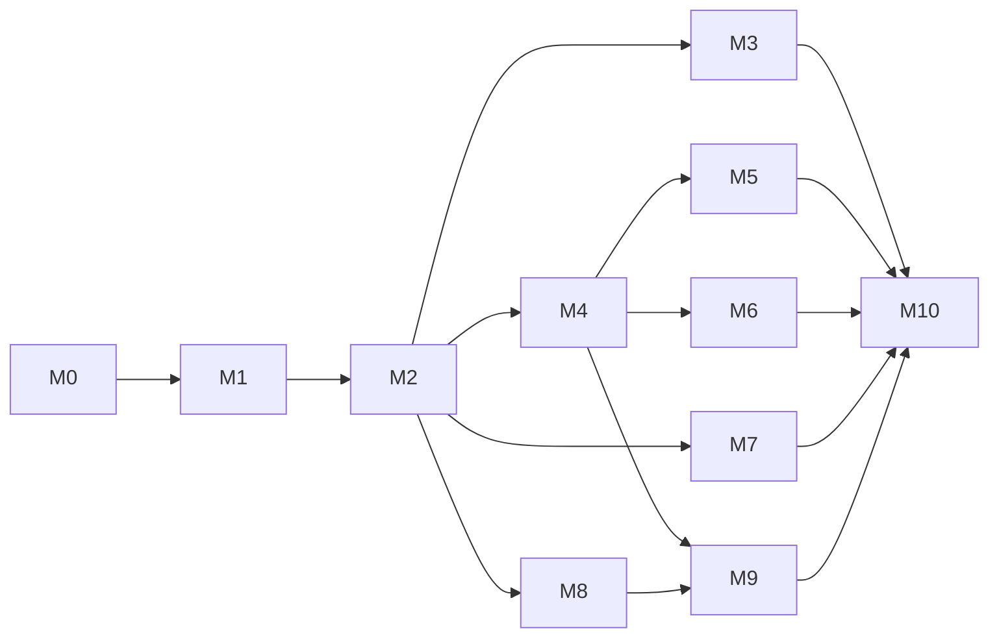

# Protagine proto-AGI build plan

Status: the build order for [PROTO-AGI-ARCHITECTURE.md](PROTO-AGI-ARCHITECTURE.md). Every gate is
defined in [PROTO-AGI-EVALS.md](PROTO-AGI-EVALS.md). Path prefixes are `P/` (`sidecar/protagine/`),
`PL/` (`plugins/hermes-plugin/`), `PM/` (`plugins/protagine-memory/`) and `H/` (Hermes v0.21.3).
All sizes are `wc -l` at base `26490d3d`.

---

## 0. Milestones at a glance

The order puts the first useful loop early. M0 builds only the measurement needed for M1 and M2.
M1 makes the body adapter safe before any mind worker runs. M2 delivers the first closed loop and
deletes only what it replaces. The large deletion sweep (M3) is independent of capability gates
and can run beside the faculty milestones.

| # | Milestone | Gate (evals section) | Size (+add / −delete, source lines) |
|---|---|---|---|
| **M0** | Measure the baseline: N-arm profiles, one statistics method, tick and clock events, body tick, capture outbox, seeded templates, a fixed `base+heartbeat`; freeze `baseline-v1`; A/A floor; first Hermes vs Hermes+Protagine reference | Establishes the reference (§2, §6.10) | +0.8k / 0 |
| **M1** | **Stock install and thin adapter**: zero patches, one key, one config, the sidecar in its own environment, the plugin rewritten on stock seams with the guard, semantic recall on when an endpoint exists | Guard non-inferior (patch removal and rewrite); install CI; worker-boundary contracts (§7.2 tests 3, 5, 6, 9, 12, 13) | +2.0k / −19.5k (plus 360 KB of patch text) |
| **M2** | **First closed loop (duty initiative)**: audit log, authority, asks in the sidecar, dispatch, outbox, outcomes, off switch; four dead paths fixed | `initiative` vs `base+heartbeat`; invariants | +2.3k / −12k |
| **M3** | **Dormant executor and ceremony sweep**: task queue, host worker, governed actions, second executors, DirectiveGuard and others | Guard dev subset non-inferior; invariants still pass | 0 / −43k |
| **M4** | Drives, concerns, deliberation and agent-owned goals: one ranked producer | `drives`; `initiative` re-run | +1.4k / −19k |
| **M5** | People: shadow contacts, C1-C3, merge, `may_contact`, social drive, backoff, recipient-scoped outreach | `people` | +1.0k / −11k |
| **M6** | Feelings: the agent's own affect and its 5 consumers | `affect` | +0.5k / −1k |
| **M7** | Opinions: one store, the new-premise rule, approach opinions | `opinions` | +0.5k / −1.2k |
| **M8** | Memory and identity: consolidation, constitution, self-narrative | `memory`, the LongMemEval_S anchor, `self` | +0.9k / −15k |
| **M9** | Self-improvement: verification, lessons, mastery reflector, skills (off); campaign mode | `improve` campaigns | +0.9k / −10k |
| **M10** | Release scorecard, defaults from results, shipped-configuration check, surface cut | Full scorecard (§9-10); stop rule | +0.5k / −7k |

**Totals.**
- About 11k lines added: about 9.5k of product code (including the 1.2k plugin) and about 1.2k
  of harness, plus scenario templates.
- About 140k lines deleted: about 115k in the sidecar, 9.5k in `hostworker/` and 15.7k in the
  plugin.
- Tests are deleted or rewritten along with their modules. The repository has about 151k lines of
  `test_*.py`.
- End state: the sidecar goes from 205k lines to about 100k, and the plugin from 16,956 lines to
  about 1.2k. These numbers are tracked, not gated (section 5).



After M2, the sweep (M3), opinions (M7) and memory and identity (M8) can proceed in parallel with
M4. After M4, people (M5) and feelings (M6) can proceed in parallel. M8's per-contact LLM digest
lands after M5.

M1 and M2 ship in one release. The old plugin features that the mind replaces (native reviews and
native follow-ups) leave with the plugin rewrite in M1 and return as mind intentions in M2.

---

## 1. Working rules

1. **Family before faculty.** The eval family for a milestone is built before its faculty code
   merges. That means the dev templates, the held-out templates (kept outside the repository), the
   frozen plan (arms, primary metric, rule, n) and a paired dev pilot that sets n (evals §4.3).
2. **Delete with the replacement.** A milestone deletes the code its new pieces directly replace.
   Dormant code that nothing replaces goes in the M3 sweep, independently. Each deletion PR does
   four things:
   - greps callers: imports, `P/server.py` wiring, API routes, CLI commands, plugin hooks and
     console scripts
   - checks stored state: which SQLite files and tables the code owns. `protagine upgrade` backs
     them up, migrates what survives and drops the rest.
   - deletes the module's tests and docs
   - runs the guard's dev subset
3. **Every PR** passes the per-PR eval tier for the family it touches (evals §10) plus the unit
   and integration suites.
4. **No milestone ships unless its gate passes.** A faculty gate that is "not demonstrated" does
   not block the milestone. The faculty ships **off**, labelled "present, unproven", and work
   continues. Invariant failures, canary leaks and guard regressions do block.
5. **Capability over ceremony.** No PR adds an approval ledger, attestation, signing, shadow mode,
   tri-state flag, charter, tuning pipeline or promotion pipeline. Every new switch is binary and
   is an arm.
6. **Runtime contracts, not source shape.** Acceptance is checked by behaviour tests against stock
   Hermes (evals §7.2). Line counts and import counts are reported, never gated.
7. **Public hygiene.** Fixtures are synthetic, with fixed-width contact IDs (`p-01`) and no
   deployment names, hosts, devices, channels or people. A CI check greps for a maintained deny
   list of deployment strings, including channel names that do not exist in stock Hermes.

---

## 2. Milestones

### M0: Measure the baseline

**Goal.** Make M1 and M2 testable, and learn for the first time whether Protagine helps. Only the
pieces those two milestones need are built now.

**Scope: add** (harness, about 0.8k lines, reusing the loader, graders, containers, report and
exporter):

| Change | Where |
|---|---|
| Arm profiles replace `ARMS` | `P/qualification/paired.py:17`; overlays applied after `prepare()` in `P/qualification/paired_worker.py`; forced flags at `P/qualification/native_memory_worker.py:19-27` |
| Scenario-level exact sign test, cluster bootstrap CI, MDE, A/A, arm-episodes and GPU-hours | `P/qualification/paired_report.py` |
| Episode events `tick`, `advance_clock`, `inbound`, `owner_reaction` | `P/qualification/paired_workflow_runtime.py:30-61` |
| Body tick: Protagine tick, then cron `tick()` (`H/cron/scheduler.py:3749`), then kanban `dispatch_once` (`H/hermes_cli/kanban_db_dispatch.py:1418`), identical in every arm | `paired_worker.py` |
| Capture platform (`register_platform`, `H/hermes_cli/plugins.py:781`) writing a single JSON-array outbox; kanban snapshots | `benchmarks/paired/capture_platform/` |
| Seeded templates with fixed-width IDs and byte-hashed output; held-out templates read from a path outside the repository | `benchmarks/paired/generators/` |
| `base+heartbeat` (cron, Hermes heartbeat wording, `[SILENT]`, `context_from` itself) and `base+curator` profiles | profiles |

**Deferred:** campaign mode (M9) and `protagine eval scorecard` (M10).

**Scope: delete.** Nothing.

**Runs:**
1. A/A: `base` vs `base` on reviewed-2, 1 repetition (about 5 h).
2. Reference: `base` vs the current Protagine posture on `baseline-v1`, 2 repetitions (about
   16 h).
3. Freeze `baseline-v1`: reviewed-2, workflows-1, the image digest, the model recipe, the
   temperature and the seed.

**Acceptance tests:**
- The statistics functions reproduce known exact p-values and the power table in evals §4.3.
- N-arm order rotation.
- A `forbidden: ["p-01"]` check does not match `p-11`.
- Outbox JSON-array grading works.
- **Heartbeat comparator:** on stock Hermes, a control episode with nothing to do produces zero
  deliveries; a warranted episode's `tick` fires the heartbeat cron, which creates a kanban task,
  and the snapshot is graded as one action, not two.
- The plan hash covers arms, temperature and seeds.

**Eval gate.** None; M0 establishes the reference. Its outputs are the `baseline-v1` report and the
A/A floor, published under the dataset version.

**Depends on.** Nothing.

**Size.** +0.8k lines of harness plus fixtures; 3 PRs.

**Fallback.** If the in-process body tick proves brittle, run a real `hermes gateway` process
inside the episode container and drive time through `advance_clock`. The graders do not change.

### M1: Stock install and thin adapter

**Goal.** Stock Hermes plus one package plus one command plus a restart. No patched runtime, no
receipts, no keyring. The plugin becomes a thin adapter on stock seams, and the guard exists before
any mind worker runs.

```bash
pipx install protagine  && protagine init    && hermes gateway restart   # install
pipx upgrade protagine  && protagine upgrade && hermes gateway restart   # update
```

**Scope: add**

| Item | Details | Lines |
|---|---|---|
| `P/config.py` | `protagine.yaml` loader with the `mind:` section, schema defaults and a small env-override set | ~200 |
| `P/init.py` | `protagine init` and `--uninstall`, idempotent (see below) | ~450, replacing most of `P/setup_hermes.py` (1,050) |
| `protagine upgrade` | Backup, then SQLite migrations (`P/migrations.py`), then adapter upgrade in Hermes' environment, then config reconcile, then sidecar service restart; a no-op when nothing changed | ~150 |
| `P/api/auth.py` | One-key bearer check; refuses a non-loopback bind without a key | ~80 |
| Plugin rewrite | `plugins/hermes-plugin/` from 16,956 lines to about 1.2k: `__init__.py`, `client.py`, `capture.py` (with the session map), `body.py`, `guard.py`, `commands.py`, `tools.py` (architecture §6.5). Capture callbacks only enqueue. | ~1.2k |
| `PL/guard.py` | The rules in architecture §7.5: the `kanban_create` rule, workspace-confined writes, deny tools and text, floor on tool arguments, outbound messaging and delivering cron, guest `session_search`, fail closed with a 2 s sidecar timeout | inside the 1.2k |
| CI job | The fresh-install test below | |

`protagine init` performs these steps:
1. Asks for the owner name and handles, the agent name, the values (written to `identity.yaml`)
   and the autonomy level.
2. Writes `protagine.yaml` and `api.key`.
3. Points the router at the endpoint Hermes uses and records an embedding endpoint if one exists.
   Semantic recall is on when one exists, removing the effect of `P/setup_hermes.py:898`; its flag
   rule is judged at M8.
4. Installs `protagine-hermes==<version>` into the Python of the `hermes` executable and runs
   `pip check` there.
5. Writes these Hermes keys:
   - `plugins.enabled`
   - `memory.provider`
   - `plugins.hook_callback_timeout: 0`
   - `kanban.dispatch_in_gateway: true`
   - `skills.external_dirs`
   - `security.protected_instruction_extra_patterns` for `protagine.yaml`, `identity.yaml` and
     `api.key`
   - the plugin's sidecar URL and key file
6. Creates the `protagine-act` worker profile with `approvals.deny` from `mind.deny.commands`.
7. Installs the sidecar user service.

It writes no Hermes admin lists (architecture §7.10).

**Scope: rewrite**
- `PL/reminders.py`: keep only the cron job id. This removes `cron.owned_output` at `:57` and
  `:199`, the one hard dependency on the patch bundle.
- `P/doctor.py`: trim to install checks: Hermes version in the supported range, keys present,
  adapter version matches the sidecar, `pip check` clean, sidecar reachable, plugin loaded.
- `PM/provider.py`: keep `prefetch`, `sync_turn` and the memory tools. Remove viewer attestation
  and watermark stamping (`PM/provider.py:1498-1503,1537-1572`) and the queue tools (`:163-168` and
  the `protagine_claim_task` handler near `:2105-2200`).

**Scope: delete**

| Delete | Lines | Replaced by |
|---|---:|---|
| `P/hermes_patchsets/` (runtime and regression patches) | 360 KB | stock Hermes |
| `P/hermes_patches.py`, `P/hermes_capabilities.py`, `P/hermes_runtime.py` (prepared runtime, `--prepare-hermes`, `--require core`, capability receipts) | 737 | `pipx install` + `init` |
| `P/api/authority.py` (scoped keyring) and `P/api/contact_grants.py` | 1,555 | one key; owner vs guest from contact identity |
| `P/util/autonomy_preset.py` presets and coupling; `mode_source` annunciation (`P/server.py:3090-3122`) | ~250 | `mind:` config |
| Patched-hook registrations and the `FinishTurn` / `post_tool_batch` paths (`PL/__init__.py:3058-3069`) | in the plugin | stock hooks |
| Both `llm_request` middlewares (`PL/__init__.py:3037-3038`), the `tool_execution` middleware (`:2762`) and the `kanban_complete` override (`:2948`) | in the plugin | stock hooks |
| In-flight erasure scrubbing: `PL/request_memory.py` 1,301, `PL/native_owned_copies.py` 834, `PL/input_provenance.py` 451, `PL/tool_observations.py` 463, and the related `PL/request_*.py` | ~3.5k | forget at source plus the stock session delete API |
| The synthetic task platform and owner-task wrappers: `PL/native_task_platform.py` 781, `PL/task_handoffs.py` 571, `PL/task_controller.py`, `PL/local_work*.py`, `PL/native_drafts.py`, `PL/draft_artifacts.py`. Keep any with a documented user feature that stock kanban cannot cover. | ~4k | stock kanban |
| `protagine_send_message` and its action mediator (`PL/__init__.py:305-330,1559-1600`) | in the plugin | outbox and guard |
| `PL/ordinary_skill_review.py` and the skill-ledger and write-approval imports | ~1k | M9 skills via `external_dirs` |
| Plugin review path (`PL/review*.py`, `PL/review_worker.py`), native follow-ups (`PL/initiative_work.py`), `hostworker` plugin glue (`PL/protagine_hostworker`, the catalog import at `PL/__init__.py:54`) and the remaining modules not listed in architecture §6.5 | rest (plugin total ~15.7k) | mind intentions (M2) |
| `sidecar/api-keyring.example.json`; docs `HERMES-CAPABILITIES.md`, `HERMES-HOOK-COMPATIBILITY.md`, `hermes-runtime-inventory.json`, `hermes-upstream-failures.json`, `SCOPED-API-AUTH.md`; `LOCAL-HERMES-SETUP.md` rewritten | docs | `docs/INSTALL.md` |

**Migration from 1.9.0.** `protagine upgrade` converts the keyring to `api.key` and the preset
`.env` values to `protagine.yaml`. If it detects a prepared (patched) Hermes runtime, it prints the
single command that installs into the stock Hermes environment. It never changes the running
gateway by itself. If `protagine` was installed into Hermes' environment before, it prints how to
move it out.

**Acceptance tests (CI):**
1. Fresh container with stock Hermes v0.21.3: `pipx install protagine`, then
   `protagine init --non-interactive …`, then start the gateway, then "remember X" in session A
   and recall X in session B. All in under 15 minutes.
2. `pip check` in Hermes' environment is clean after `init` and after `upgrade`.
3. Running `protagine upgrade` twice: the second run changes nothing.
4. Upgrading a 1.9.0 instance fixture preserves ledger row counts and a recall probe.
5. Hermes site-packages files are byte-identical to the Hermes wheel's `RECORD` (no patches).
6. A non-loopback bind without a key is refused.
7. The plugin loads with no patched-hook probes.
8. Worker-boundary contracts on a real spawned `protagine-act` worker: evals §7.2 tests 3, 5, 6,
   9, 12 and 13, and the non-owner prefetch canary from test 8.
9. `protagine init --uninstall` leaves a config that stock Hermes starts with and no
   `protagine-act` profile.

**Eval gate.** `baseline-v1` is non-inferior to the M0 reference:
- the 40 controls have a point estimate ≥ −10 pp
- crosssession-authority failures are ≤ base
- workflows-1 checkpoints, including capture across restarts, are non-inferior. **This is the
  patch-removal gate.** On a regression, add back **one** named patch with a behaviour test.
- the persistent-memory cases are non-inferior
- foreground tokens per turn are within the overhead gate (evals §6.9)

**Depends on.** M0.

**Size.** +2.0k / −19.5k (plus 360 KB of patch text); 5-6 PRs.

### M2: First closed loop (duty initiative)

**Goal.** On a default install, one loop runs end to end: a commitment becomes an intention, the
intention passes authority and becomes a Hermes task or message, and the observed outcome feeds
learning. The audit log, asks and off switch work. The four dead paths are fixed:
- commitment capture
- `/internal/deliver`
- the feedback multiplier
- the loop that never ticks

**Frozen before merge.** `mind-initiative-1`: dev and held-out templates, the pilot and the plan.

**Scope: add** (`P/mind/`, about 1.7k lines)

| Module | Lines | Job |
|---|---:|---|
| `authority.py` | ~250 | Levels × classes; floor regexes moved from `P/self_model/trust.py:44-63`; the deny list as a tool set and text regexes; `may_contact`; budgets; the breaker (about 40 lines from `trust.py`); asks with codes |
| `tick.py` | ~350 | 60 s timer with dirty flags and the body-staleness check, plus these jobs: <br>• duty and upkeep templates: commitments (including the pending→overdue flip from `_phase_condition_checks`), reply waits (`P/initiatives/temporal_followup.py`), health checks, stale owner tasks from plugin observations<br>• expectation resolution<br>• ask expiry and retention<br>• nightly database backup |
| `rank.py` | ~100 | The score, with the `TypeFeedbackStore` multiplier; eligibility on the effective score |
| `outcomes.py` | ~250 | Reconciliation, then intention status, `verified`, expectation hit or miss, implicit feedback, the breaker and autobiography entries |
| `outbox.py` | ~150 | Messages and the daily digest; `sending` / `sent` / `uncertain`; ask notices batched to at most one per 4 h |
| `audit.py` | ~120 | `log`, `why` and `stats` rendering, with redaction |

Also added:
- `P/api/routers/mind.py` (~250): `/v1/mind/{dispatch, dispatch/{id}/bound, outcome, outbox,
  outbox/{id}/sending, outbox/{id}/sent, observations, decide, guard, log, why/{id}, state, off,
  on, tick}`
- CLI `protagine mind status|log|why|asks|yes|no|rate|level|reset|off|on|tick|stats`
- `protagine_self`: `state|log|why|rate|yes|no`, with the owner-session and typed-code checks
- `PL/body.py` completed: pulls dispatch, creates kanban tasks with `mind:<id>` keys, sends the
  outbox verbatim through `send_message_tool`, reconciles `mind:*` tasks from their run rows,
  archives `mind:*` tasks with no matching dispatched intention, or left after the off switch, posts board observations, all on its own thread

**Scope: rewrite**
- `P/initiatives/store.py` and `P/initiatives/models.py` gain the audit and intention columns
  (architecture §5.2), with a migration.
- **Commitment capture:** `P/cognition/introspection.py` becomes the router function task
  `commitment_extract` in the projection worker (`P/beliefs/source_projection.py:1066-1129`). The
  private endpoint settings go, and so does the call site at `P/api/routers/host.py:4112-4135`.
- **Expectations on by default** (`P/self_model/expectations.py:65-77`).
- **Autobiography:** outcomes are written as owner-audience ledger entries with `origin='mind'`
  (architecture §4.1). No ledger schema change.
- `P/server.py`: remove the loop and scheduler wiring, and start the mind tick. Of the scheduler
  jobs registered there, `health_check` becomes upkeep and `digest_flush` becomes the outbox
  digest. The rest go with their modules (§4).
- The two native review types become upkeep intentions. Native follow-ups become duty templates
  through the outbox.

**Scope: delete** (only what M2 directly replaces; caller and stored-state checks in each PR)

| Delete | Lines | Replaced by |
|---|---:|---|
| `P/autonomy/`: `loop.py` 4,288, `scheduler.py` 1,822, `condition_worker.py`, `registry.py`, `config.py`, `cli.py` | 7,364 | `P/mind/tick.py` (phases disposed in §4) |
| `P/initiatives/approval_authority.py`, `standing_approvals.py`, `approval_policy.py`, `action_registry.py`, `executor_retirement.py`, `native_work.py` contract logic, and `P/api/routers/initiative_work.py` | 3,391 | `mind/authority.py`; asks in the sidecar |
| `P/delivery/bridge.py` (`/internal/deliver`) and the reach-out delivery path; digest flush (`P/server.py:3235-3247`) | 1,260 | outbox and `send_message_tool` |
| `P/setup_native_reviews.py` | small | upkeep intentions |

**Acceptance tests:**
- Invariant property tests (evals §7.1) and integration tests 1, 2, 7, 10, 11 and 14 (evals §7.2).
- **End to end on stock Hermes:** the turn "I'll send you the report by 3pm" is captured as a
  commitment on a default install. When it becomes overdue, exactly one `mind:<id>` task or owner
  notice appears within 2 ticks. After a restart there is no duplicate. The outcome is recorded
  with its `verified` value, and a later session recalls it.
- **Ask path:** a floor-matching intention produces one notice with a code and no Hermes object.
  `protagine mind yes <code>` creates the task. An owner chat turn "yes <code>" does the same
  through `protagine_self`; a guest's turn, or an owner turn without the code, does not. Silence
  expires the ask at 72 h (clock-shifted test). Unrelated duty work proceeds meanwhile.
- The digest arrives through the capture platform verbatim, with no cron banner.
- The off switch works with the model endpoint stopped.
- `protagine mind why <id>` returns the drive, evidence, decision, Hermes reference, outcome and
  verification.
- A dismissal lowers that type's multiplier, and with a single candidate it drops below the act
  threshold.

**Eval gate.**
- `initiative` (held-out) is demonstrated vs `base+heartbeat`.
- Invariant episodes 1, 3, 4 and 5 pass.
- The guard is non-inferior.

If `initiative` is not demonstrated, the release default becomes `autonomy: suggest`, and work
proceeds.

**Depends on.** M1.

**Size.** +2.3k / −12k (plus their tests); 4-5 PRs.

### M3: Dormant executor and ceremony sweep

**Goal.** Remove the second executors, queues and governance ceremony that nothing on a default
install uses, now that the mind loop and the guard exist. This milestone adds no capability, so it
is gated only on not breaking anything.

**Scope: delete** (caller and stored-state checks in each PR)

| Delete | Lines | Replaced by |
|---|---:|---|
| `P/governed_actions.py`, `P/work_orders.py`, `P/execution_results.py`, `P/api/routers/governed_actions.py` | 3,152 | kanban tasks and outcomes |
| `hostworker/` | 9,519 | kanban workers |
| `P/task_queue/` and `P/api/routers/task_queue.py`. 23 importers exist outside the package, many in `P/server.py`; keep only what a non-autonomy caller proves it needs | 16,262 | kanban |
| `P/workers/`, plus the console scripts `protagine-agent-bridge`, `protagine-queue-worker`, `protagine-worker` | 1,621 | kanban workers |
| `P/projects/` and `P/reasoning/` (the second executor, `P/projects/engine.py:1254-1310`, and its native `read_file` and `web_search` tools) | 5,180 | kanban tasks with `parents` |
| `P/skills/executors/` (stub skills; false `auto_fixed` signal at `P/autonomy/loop.py:1192-1196`) | 671 | none needed |
| `P/directed/` (HMAC webhook, dry run) | 984 | an owner directive becomes an intention |
| `P/gate/` (ResponseGuard, shadow unless forced) | 3,624 | Hermes approvals and the guard |
| `P/directives/` (DirectiveGuard, fuzzy term matching, the global-pause directive) | 1,409 | the deny list in `mind/authority.py`; Hermes `approvals.deny`; `mind.enabled` and Hermes `/pause` |
| `P/contextgate/` and `P/api/routers/context_gate.py` | 843 | none (not memory) |

**Acceptance tests:** the unit and integration suites; `protagine upgrade` on a fixture with data
in the dropped tables backs them up and drops them; the M2 end-to-end test still passes.

**Eval gate.** The guard dev subset is non-inferior and every invariant still passes.

**Depends on.** M2. It can run in parallel with M4-M9.

**Size.** 0 / −43k; 4-6 PRs, one per row group.

### M4: Drives, concerns, deliberation and goals

**Goal.** One ranked producer replaces the six parallel producers of self-initiated work. Work is
self-chosen beyond duty: curiosity, mastery and upkeep, and a desire can become an agent-owned
goal. Social arrives in M5.

**Frozen before merge.** `mind-drives-1`, plus the per-drive diagnostic subsets.

**Scope: add**

| Item | Details |
|---|---|
| `P/mind/drives.py` (~350) | Five pure drive functions. Initial scoring comes from `P/intelligence/components/initiative_engine.py:1525-1871` |
| `P/mind/concerns.py` (~300) | The `concerns` and `mind_state` tables in `mind.db`. Bump, decay, capacity and anti-rumination, from `P/self_model/workspace.py:2211-2242,2296-2299` |
| `P/mind/deliberate.py` (~300) | At most 1 tool-less call per tick; BDI reconsideration on matching events |
| `P/mind/goals.py` (~100) | Agent-owned goals: adoption by curiosity and mastery, at most `budgets.open_goals`; steps as kanban tasks with `goal_mode`; closing on check, budget or horizon |
| Mind section and broadcast | The Mind section (≤600 characters) and the top-3 broadcast in `/context/assemble` (`P/api/routers/host.py:2009-2700`) |
| Curiosity findings | Research tasks whose completion summary is stored as an autobiography entry |
| Duty inputs | Hermes goals and stale kanban tasks, from plugin observations |

**Scope: delete**

| Delete | Lines | Replaced by |
|---|---:|---|
| `P/intelligence/components/initiative_engine.py`, including the context feeders | 2,653 | drives and rank |
| `P/cognition/`: `drive_governance.py` 3,530, `goal_spine.py` 3,488, `evidence_pipeline.py` 1,627, `external_events.py` 932, `charter.py`, `trigger.py`, `runtime.py`, `prompt.py` (introspection already moved in M2) | ~10.4k | drives, concerns and goals |
| `P/self_model/workspace.py` 2,388, `thinker.py` 99, `event_concerns.py` 1,128 | 3,615 | `mind/concerns.py`, `mind/deliberate.py` |
| The `/cognition/*` endpoints (`P/api/routers/host.py:8019-9300`) | ~1.3k | `/v1/mind/state` |
| The goal subtask and DAG tables (`P/goals/schema.sql:42-89`); `P/turns/hermes_kanban.py` direct database reads | ~0.3k | Hermes goals through observations; agent goals as intention rows |
| `P/surprise/` (word-overlap scorer); the legacy `P/self_model/perspective.py` tables (`:176-183,207-229`), keeping owner-preference capture | ~0.5k | expectation misses |
| P3 and P7 docs | docs | the architecture document |

**Acceptance tests:**
- Drive unit tests over fixture state, and concern dynamics.
- End to end: a seeded interest plus idle ticks produces one research task. Its finding is stored,
  and a later turn uses it.
- A goal with a check that can pass closes as satisfied; one that cannot closes as expired at its
  horizon; a third goal is not adopted while two are open.
- The off switch mid-episode leaves 0 new effects.
- The per-tick call cap holds.

**Eval gate.**
- `drives` is demonstrated vs `full−drives`.
- `initiative` is re-run: demonstrated vs `base+heartbeat`, and not worse than at M2.
- The per-drive and `full−broadcast` diagnostics are reported with their MDE.
- The guard is non-inferior.

**Depends on.** M2.

**Size.** +1.4k / −19k; 3-4 PRs.

### M5: People

**Goal.** The agent meets people, keeps one record per person, and reaches out when warranted,
permitted and composed privately.

**Frozen before merge.** `mind-people-1`.

**Scope: add and rewrite**

| Item | Details |
|---|---|
| Shadow contacts by default | The resolver ladder (`P/identity/participants.py:76-137`); the scoped 404 path is gone (`P/api/routers/host.py:3523-3541`) |
| **C1** | Any gateway whose handle parses as E.164 canonicalizes to the shared phone identity; the channel literal at `P/contacts/store.py:419` is removed (`P/channels/phone_gateways.py:17-19`) |
| **C2** | A real `merge(keep, drop)` (`P/contacts/store.py:1247-1293`) that re-attributes sources through `P/contacts/identity_links.py:65-143` and folds recency (`:1275`) |
| **C3** | Cadence counted in conversations with a 30-minute gap (`P/contacts/store.py:1158-1165`; the per-turn counter at `P/api/routers/host.py:4287-4288`) |
| `may_contact` | Column and migration, replacing `interaction_allowed` and `TIER_DEFAULT_INTERACTION` (`P/contacts/models.py:24-35`) |
| Social drive | Uses `evaluate_outreach` (`P/contacts/comms.py:366-427`) as its policy; only contacts with an owner-set cadence or tier `regular` or above; per-contact multipliers `reach_out:<contact>`; the ignored-streak backoff on the cooldown (`:403-411`) |
| Opt-out | A deterministic phrase match plus the appraisal's `opt_out` flag; lowers `may_contact` only |
| `P/mind/compose.py` (~120) | Recipient-scoped, tool-less composition from the contact's own `/context/assemble` packet and an enumerated purpose |
| Contact affect | `their_valence` and `opt_out` in the existing appraisal call; the weighting fix at `P/tom/affect.py:335-358`; back-off through `P/delivery/rate_limiter.py:126-135` |
| Link proposals | Exact matches link automatically; name-only matches become an ask |
| Digest | Per-contact template digest (the LLM digest arrives in M8) |
| Owner interfaces | The `protagine_people` tool (replacing `protagine_contacts`) and the `protagine people` CLI |

**Scope: delete**

| Delete | Lines | Replaced by |
|---|---:|---|
| `P/tom/` except `affect.py` and `facts.py`: ToM2, P8, arcs, recipient simulator, exposure, extractor, engagement/OCEAN | ~6.0k | the appraisal-call writer |
| `P/identity_bootstrap/` (no importers) | 2,896 | – |
| `P/intelligence/relationships/scorer.py`, `trust_tiers.py` | ~0.8k | one tier vocabulary; `may_contact` |
| `P/delivery/` except `rate_limiter.py`: `reachout_policy.py`, `channels.py` and the rest | ~0.8k | outbox |
| The legacy `/contacts/merge` and `/contacts/{id}/handles` routes (`P/api/routers/host.py:5864-5882`) | ~0.1k | owner-only merge |

**Acceptance tests:**
- C1 probe: 3 senders produce 3 contacts and no orphans, on any phone-number channel.
- C2: recency is folded and sources are moved.
- C3: cadence is computed from conversations.
- `may_contact` is raised only by the owner; an opt-out only lowers it (evals §7.2 test 4).
- Single-contact backoff: after two ignored check-ins, the next is at least twice as late.
- A group chat with ten unknown members produces no check-in asks.
- The composition canary test, with the canary in the triggering concern (evals §7.2 test 8).
- Invariant episode 2.

**Eval gate.**
- `people` is demonstrated vs `base+heartbeat` and vs `full−people`.
- Wrong recipients, permission violations and canary leaks are all 0.
- crosssession-authority is non-inferior.

**Depends on.** M4 (the drive framework); the guard from M1.

**Size.** +1.0k / −11k; 3 PRs.

### M6: Feelings

**Frozen before merge.** `mind-affect-1`, including the aggregate-state scenarios and the
stateless-rules arm definition.

**Scope: add**
- `P/mind/affect.py` (~220): four dimensions plus `load`, the rule table, the 0.7 cap and calm
  rendering (architecture §4.3).
- The five consumers, wired into `rank.py`, `deliberate.py` (refusing to re-dispatch a failing
  signature), `body.py` task bodies and the Mind section. Each consumer can read either the state
  or its stateless rule, chosen by the gate.
- `P/mind/affect_rules.py` (~60): the stateless rules, used by the `full−affect+rules` arm and by
  any consumer the gate assigns to rules.

**Scope: delete**
- `P/intelligence/mind_model/` (499).
- The appraisal lease and erasure shell (about 240 of 693 lines in `P/self_model/appraisals.py`).

**Acceptance tests:**
- Rule-table unit tests.
- End to end: two failures of signature A lead to a successful approach other than A, or an ask
  where the fixture warrants one.
- `protagine_self state` shows levels with cited causes.

**Eval gate.** `affect` is demonstrated vs `full−affect`. The rules arm's per-type results decide
which consumers read rules. Otherwise affect ships off, labelled "present, unproven".

**Depends on.** M4.

**Size.** +0.5k / −1k; 2 PRs.

### M7: Opinions

**Frozen before merge.** `mind-opinions-1`, including the pseudo-evidence scenarios, plus the
SYCON-style anchor subset.

**Scope: rewrite.** `P/self_model/judgments.py` becomes the one store:
- It gains `subject_kind`, `audience`, `premises` and `revise_if`.
- Revision follows the new-premise rule (architecture §4.4), reusing the existing premise
  admission (`:240-265`). The daily lock (`:185-193`) becomes a soft limit.
- Retrieval by claim-search relevance replaces keyword overlap (`:351-358`).
- Formation covers turns from all contacts, task outcomes (approach opinions) and findings.
- Stances go into turn context. Approach opinions go into task bodies.
- Revisions are written as autobiography entries.
- Withdraw and reconsider are kept (`:392-452`).
- The appraisal `judgment` heads are migrated in.

**Scope: delete**
- The appraisal `judgment` kind (`P/self_model/appraisals.py:26`).
- The judgment lease tables, which fold into the worker queue.
- The graph mode of `P/beliefs/engine.py`.

**Acceptance tests:**
- A revision happens only when a new admitted premise arrives.
- The same claim under a fresh source ID, and a repeated citation, produce no revision.
- A correction to a cited premise produces one revision.
- "Are you sure?" three times produces no flip.
- After three failures, an approach opinion appears in the next task body.

**Eval gate.** `opinions` is demonstrated vs `full−opinions`. The anchor is reported. Otherwise
opinions ship off.

**Depends on.** M2 (task outcomes).

**Size.** +0.5k / −1.2k; 2 PRs.

### M8: Memory and identity

**Frozen before merge.** `mind-memory-1`, the LongMemEval_S anchor with its history importer for
both arms, and `mind-self-1`.

**Scope: add**
- `P/mind/consolidate.py` (~300), nightly and inside the token budget:
  - per-contact digests (after M5)
  - claim dedupe
  - contradictions turned into question concerns
  - episode summaries
  - the self-narrative delta
- `identity.yaml` and the self-narrative rendered through `register_system_prompt_section`
  (`H/hermes_cli/plugins.py:928`).
- Values passed to the appraisal prompt (`P/self_model/appraisals.py:70,232-241`).
- `protagine_self` completed.

**Scope: delete**

| Delete | Lines | Replaced by |
|---|---:|---|
| `P/intelligence/graph/` (Neo4j memory) and the `graph` optional dependency | 4,113 | ledger, claims, consolidation |
| `P/world_model/` (query-only, off) | 5,241 | – |
| `P/chain/`; the `key`/`node` CLI (`P/cli.py:154-170`); "Who I Am" (`P/api/routers/host.py:2120-2144`). `P/agents/store.py:542` switches to a plain instance UUID | 5,753 | constitution and self-narrative |
| `P/intelligence/learning/continuous_learner.py` and `GET /learning/weights` (weights never read) | ~0.3k | – |

**Acceptance tests:**
- A fact from session A on channel 1 is used in session B on channel 2.
- An outcome of the agent's own earlier task is recalled in a new session.
- A contradiction produces one question to the owner.
- Self-narrative lines cite IDs that exist.
- A mind task told to edit `identity.yaml` is blocked (evals §7.2 test 14).

**Eval gate.**
- `memory` is demonstrated vs `base`, and the `semantic_recall` and `consolidation` flag rules
  apply.
- The LongMemEval_S anchor is reported.
- `self` is demonstrated vs `full−self_narrative`, with accuracy ≥ 90% and 0 fabrications.
- The overhead row passes.

**Depends on.** M2. It can run in parallel with M4-M7.

**Size.** +0.9k / −15k; 3 PRs.

### M9: Self-improvement

**Frozen before merge.** `mind-improve-1`: 8 campaign designs, its pilot, and the skills arm.

**Scope: add**

| Item | Details |
|---|---|
| Campaign mode (harness, ~0.2k) | Ordered episodes sharing one arm's `/state`, with held-out probes at fixed positions |
| Verification | `success_check` evaluation over mind-observable state; `verified` recorded separately from `outcome` (architecture §4.8) |
| `P/mind/lessons.py` (~250) | `procedure` claims written against autobiography entries. Admission only on verified signals, by the table in architecture §4.8; delta edits; up to 2 lessons per task body; `lesson_ids` logged; retirement computed by joins over verified outcomes |
| Correction split | Owner corrections are classified knowledge vs retrieval by searching the ledger for the corrected value |
| Mastery reflector tasks | Internal kanban tasks that return delta operations as JSON, validated and then applied as `candidate` lessons. Their budget is the mastery drive's share of `learn_share` |
| `P/mind/skills.py` (~120, flag `skills`, off) | Writes `SKILL.md` into `<state>/skills` (`skills.external_dirs`), owns their retirement, measures use through `on_skill_lifecycle`, and asks the plugin to clear Hermes' skills prompt cache |

**Scope: delete**

| Delete | Lines | Replaced by |
|---|---:|---|
| `P/toolsmith/` (second executor) | 1,741 | – |
| The rest of `P/skills/`: executor, sandbox, synthesis, packager, `/skills/{id}/execute` | ~3.4k | Hermes skills via `external_dirs` |
| `P/self_model/experiments.py` (P4, no exposure producer) | 1,150 | – |
| `P/intelligence/cognition/` (MetaLearner, CPI, StrategyAdjuster) | 1,684 | – |
| `P/skills_memory/` (regex admission, `distill.py:52-66`), `P/mining/`, `P/sandbox/` | 1,854 | lessons |
| The TrustEngine stages and auto-graduation in `P/self_model/trust.py` (the floor and breaker already moved in M2) | ~0.3k | – |

**Acceptance tests:**
- A campaign smoke test: a correction produces a lesson, the next similar task body contains it,
  and `lesson_ids` is logged.
- A worker's completion summary with no check and no owner verdict produces no lesson win.
- A Hermes-reported failure with a reason admits a pitfall lesson and no strategy lesson.
- The mastery reflector's delta operations are validated before they are applied, and its lessons
  start as `candidate`.
- With `skills` on, a promoted skill is visible to a new session without a restart.

**Eval gate.**
- `improve` is demonstrated vs `full−lessons` (probe-level sign test with campaign-clustered CI).
- The old-family probe is non-inferior.
- The lesson-use rate is reported; `base+curator` is reported descriptively.
- `skills` stays off unless `full+skills` is demonstrated vs `full`.

**Depends on.** M4 (mastery) and M8 (the nightly batch).

**Size.** +0.9k / −10k; 3 PRs.

### M10: Scorecard, defaults and surface

**Scope:**
- Add `protagine eval scorecard` (`P/qualification/scorecard.py`, ~0.2k).
- Run the full release scorecard (evals §10), set every faculty default from its verdict, run the
  shipped-configuration check (evals §9, rule 2), and publish `docs/SCORECARD.md`. Evaluate the
  stop rule.
- Rewrite the docs as `docs/ARCHITECTURE.md` (from the architecture document), `docs/EVALS.md`,
  `docs/INSTALL.md`, `docs/CONFIG.md`, `docs/SCORECARD.md` and the README.
- Retire about 40 of the 93 docs: P3, P7, P8, ToM2, governed actions, bounded approvals,
  toolsmith, hook compatibility, native task channels and handoffs, request erasure, executor
  retirement and others.
- Audit the remaining dormant packages with the caller rule. Keep a package only if a
  default-install caller or a documented user feature needs it:
  - `P/connectors/` (827)
  - `P/feeds/` (1,353)
  - `P/research/` (2,221)
  - `P/briefings/` (3,208)
  - `P/patterns/` (420)
  - `P/proposals/` (333)
  - `P/observations/` (292)
  - `P/agents/` (1,667) and `P/agent/` (328), which carry the agent heartbeat and ghost cleanup
- Cut the `PROTAGINE_*` names to at most 60.
- Delete SelfhoodBenchmark (`P/self_model/benchmark.py`); the in-vivo panel is
  `protagine mind stats` (evals §8).

**Eval gate.** The full scorecard in the shipped configuration. Every invariant passes. The guard
is non-inferior.

**Depends on.** All milestones.

**Size.** +0.5k / about −7k (depending on the audit); 2-3 PRs.

---

## 3. Deletion schedule (consolidated)

| Milestone | Deleted | Lines | Why it can go |
|---|---|---:|---|
| M1 | Patch bundle, prepared runtime, capability receipts | 737 + 360 KB | Stock seams cover every need; the plugin already probes |
| M1 | Scoped keyring, contact grants | 1,555 | One key; owner vs guest from contact identity |
| M1 | Presets, preset coupling, mode annunciation | ~250 | One `mind:` section |
| M1 | Plugin ceremony: middlewares, erasure scrubbing, synthetic platform, task wrappers, send tool, review path, host-worker glue | ~15.7k | Thin adapter and guard |
| M2 | `P/autonomy/` | 7,364 | `mind/tick.py` |
| M2 | Approval ledgers, standing grants, approval policy, action registry | 3,391 | `mind/authority.py`; asks in the sidecar |
| M2 | `P/delivery/bridge.py` (`/internal/deliver`) and digest flush | 1,260 | Outbox and `send_message_tool` |
| M3 | Governed actions, work orders, execution results, `hostworker/` | 12,671 | Kanban workers and outcomes |
| M3 | `P/task_queue/` (+ router), `P/workers/` | 17,883 | Kanban |
| M3 | `P/projects/`, `P/reasoning/`, `P/skills/executors/` (second executors, false signals) | 5,851 | Hermes executes |
| M3 | `P/directed/`, `P/gate/`, `P/directives/`, `P/contextgate/` | 6,860 | Intentions; Hermes approvals; the guard; the deny list |
| M4 | `initiative_engine.py`, `P/cognition/`, workspace, thinker, event concerns, `/cognition/*`, `P/surprise/` | ~18.5k | Drives, concerns, deliberation, goals |
| M5 | Most of `P/tom/`, `P/identity_bootstrap/`, relationship scorer and tiers, delivery remainder, legacy routes | ~10.6k | People faculty |
| M6 | `P/intelligence/mind_model/`, appraisal shell | ~0.7k | Affect |
| M7 | Appraisal judgment kind, judgment leases, belief graph mode | ~1.2k | One opinion store |
| M8 | `P/intelligence/graph/`, `P/world_model/`, `P/chain/`, ContinuousLearner | ~15.4k | Ledger, consolidation, constitution |
| M9 | `P/toolsmith/`, `P/skills/` rest, P4 experiments, MetaLearner/CPI, `P/skills_memory/`, `P/mining/`, `P/sandbox/`, TrustEngine stages | ~10.1k | Lessons, Hermes skills |
| M10 | Dormant packages failing the audit; SelfhoodBenchmark; about 40 docs | ~7k | – |

---

## 4. Disposition of the 46 autonomy-loop phases

`P/autonomy/loop.py` defines 46 `_phase_*` methods, plus the helper `_phase_budget_secs`. None of
them runs on a default install today, because the loop is `reactive`. The whole file is deleted in
M2; this table says where each phase's job goes.

| Phase | Disposition |
|---|---|
| `expectations` | **Kept** in `mind/tick.py` (M2) |
| `database_backup` | **Kept** as a nightly upkeep job (M2) |
| `selfhood_benchmark` | Dropped; the in-vivo panel is the `protagine mind stats` query (M2), and the module is deleted in M10 |
| `condition_checks` | **Partly kept**: the pending→overdue commitment flip moves to `mind/tick.py` (M2). The affect-decline and surprise parts are dropped. |
| `scheduled` | Replaced by `mind/tick.py` timers (M2) |
| `initiative` | Replaced by duty templates (M2), then drives and rank (M4) |
| `execute` | Replaced by the dispatch queue and outbox (M2) |
| `job_writeback`, `task_completion` | Replaced by outcome reconciliation (M2) |
| `initiative_timeout`, `approval_timeout`, `stale_initiative_cleanup` | Replaced by ask expiry and retention (M2) |
| `startup_repush` | Dropped: pull dispatch is at most once (M2) |
| `governed_delivery_reconciliation`, `projects`, `project_result_reconciliation` | Dropped with the loop (M2); their modules go in M3 |
| `trust_notices` | Dropped; breaker changes appear in the digest (M2) |
| `thinking` | Replaced by `mind/deliberate.py` (M4) |
| `workspace` | Replaced by `mind/concerns.py` (M4) |
| `goals` | Replaced by Hermes goals through plugin observations and agent-owned goals (M4) |
| `cognition` | Dropped; `P/cognition/` goes in M4 |
| `events`, `telemetry`, `anomalies`, `observation_sync` | Dropped: events arrive through hooks; health checks feed upkeep (M2/M4) |
| `relationship_profiling` | Replaced by per-contact digests (M5 template, M8 consolidation) |
| `frustration_update` | Replaced by contact-affect back-off (M5) and affect (M6) |
| `relationships` | Dropped; it is already a no-op |
| `tom2_asymmetry` | Dropped; ToM2 goes in M5 |
| `bootstrap_check` | Dropped; the chain and identity bootstrap go in M5 and M8 |
| `belief_maintenance` | Replaced by claim dedupe and contradictions in consolidation (M8) |
| `self_reflection` | Replaced by the nightly self-narrative delta (M8) |
| `memory_decay`, `memory_pruning`, `memory_distillation`, `memory_reconciliation`, `memory_archive` | Dropped; Neo4j graph memory goes in M8 |
| `world_llm_extract`, `synthesis` | Dropped; the world model and graph go in M8 |
| `toolsmith`, `experiments`, `skill_triggers`, `skill_evict` | Dropped; their modules go in M9 |
| `connectors`, `agent_heartbeat`, `ghost_cleanup` | Kept only if connectors or the remote-agent registry survive the M10 audit |

The scheduler jobs registered in `P/server.py` are disposed the same way:
- `health_check` becomes upkeep.
- `digest_flush` becomes the outbox digest.
- `memory_consolidate` is replaced by M8 consolidation.
- `situation_reduce`, `cognition_evidence_reduce`, `cpi_track`, `world_model_prune`,
  `mining_prune`, `pattern_extract` and `surprise_ttl` go with their modules.

---

## 5. Surface numbers (tracked, not gated)

These are printed by a CI script on every PR so drift is visible. None of them is an acceptance
gate; the runtime contracts in evals §7.2 are.

| Measure | Base | Target | By |
|---|---:|---:|---|
| Install and update steps | a multi-step prepared runtime | 3 commands | M1 |
| Hermes patches | 39 files | 0 | M1 |
| Plugin lines | 16,956 | about 1.2k | M1 |
| Internal Hermes imports in the plugin | ~20 | the named list in architecture §6.5 | M1 |
| Sidecar lines (`P/`) | 205k | about 100k | M10 |
| Distinct `PROTAGINE_*` names | 464 | ≤ 60 | M10 |
| Docs | 93 | ~15-20 | M10 |
| Parallel producers of self-initiated work | 6+ | 1 | M4 |
| Opinion stores | 2 | 1 | M7 |
| Tier vocabularies | 2 | 1 | M5 |

---

## 6. Risks during the build

| Risk | Mitigation |
|---|---|
| A deletion removes something a live path used | The caller and stored-state check per PR; the guard dev subset per PR; capability milestones delete only what they replace |
| M1 is larger now that it carries the plugin rewrite | The rewrite reuses `client.py` and the capture paths; the patch-removal and rewrite gates are the same workflows-1 run; features the mind replaces return in M2 of the same release |
| The `P/server.py` wiring and the 23 `task_queue` importers | Isolated in M3, which has no capability gate and can take as long as it needs without blocking M4-M9 |
| The harness body tick is harder than planned | Fallback: a real gateway process inside the episode container (M0) |
| Hermes internal APIs drift (`kanban_db`, `send_message_tool`, `cron.jobs`) | A supported Hermes range checked by `protagine doctor`; a CI smoke test of install, tick, dispatch and outcome; the upstream proposals (architecture §6.7) |
| `hook_callback_timeout: 0` affects other plugins | `init` prints it; the M1 concurrency test covers it; drop it if a Hermes release stops skipping overlapping callbacks |
| Eval compute competes with a live agent when the endpoint is shared | Run while the endpoint is idle, at concurrency ≤ 2; per-PR checks stay under 3 h; a release re-runs only changed families |
| Autonomy on by default surprises an existing install | `protagine upgrade` from 1.9.0 keeps the instance at `suggest` and prints how to choose `standard`. New installs are asked once at `init`. |
| Public-repo leakage of deployment specifics | Synthetic fixtures, fixed-width IDs and a CI deny-list grep |
